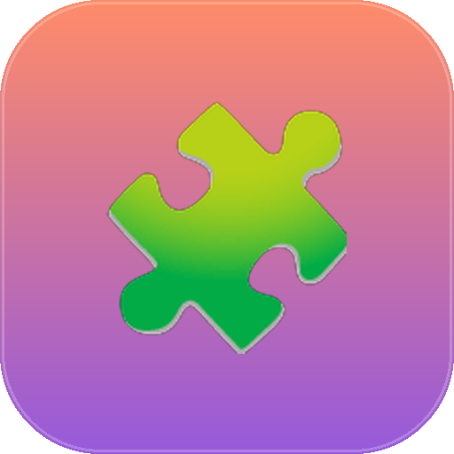
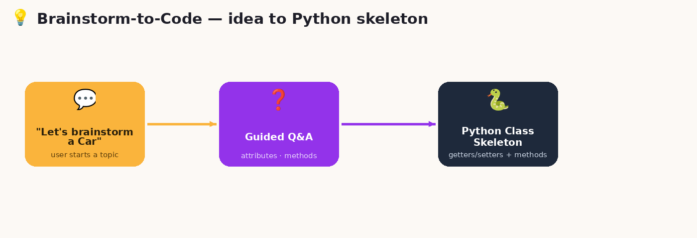
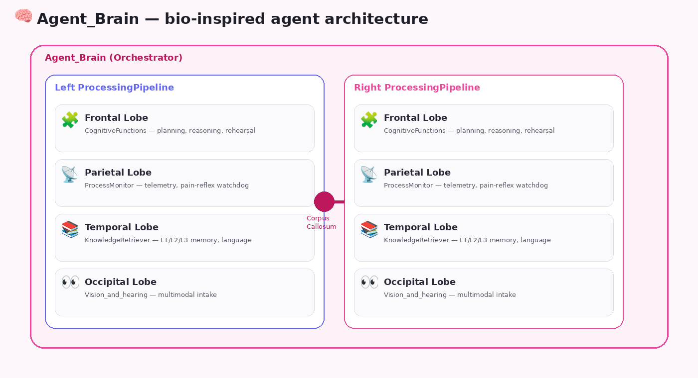

<p align="center">
  
</p>

<h1 align="center">🧩 Claude Code Skills</h1>

<p align="center">
  <b>A personal collection of Claude Skills — reusable, self-contained instruction packs that give Claude specialized workflows for specific tasks.</b>
</p>

<p align="center">
  
  
  
  
</p>

---

## 📖 What is a Claude Skill?

A **Skill** is a folder containing a `SKILL.md` file (plus optional scripts, templates, and reference docs) that teaches Claude a specialized, repeatable workflow — triggered automatically when a matching request comes in. Instead of re-explaining how you want something done every time, you drop a skill in once and Claude follows it consistently from then on.

This repo collects the skills below, each in its own folder with full documentation.

## 🗂️ Skills in this repo

| | Skill | What it does |
|---|---|---|
| 📝 | **[Notes OCR](./notes-ocr)** | Digitizes handwritten scans/photos into Markdown + Excel + PDF, with faithful Mermaid diagram reconstruction |
| 💡 | **[Brainstorm-to-Code](./brainstorm-to-code)** | Interactively brainstorms a topic and generates a Python class skeleton (attributes, getters/setters, method stubs) |
| 🧠 | **[Agent_Brain](./brain-anatomy)** | A bio-inspired AI agent architecture that maps cerebral-cortex lobes onto orchestration modules — reference design + 10 UML diagrams |
| 🔄 | **[Update GitHub Overview](./update-github-overview)** | Checks your GitHub repos and syncs your profile README's repo-count badge and Featured Projects section |
| 🏗️ | **[Architecture Diagram](./architecture-diagram)** | Generates dark-themed, self-contained SVG/HTML architecture, cloud/infra, and microservice topology diagrams |
| 📐 | **[System Analysis & Design](./system-analysis-and-design)** | Produces exam-quality SRS + system-design documents from a project idea, and audits existing codebases against CS principles with evidence-based scoring |

---

## 📝 Notes OCR

<p align="center">
  
</p>

Converts a photo, scan, or PDF of handwritten notes into three clean outputs at once: a Markdown document (with hand-drawn diagrams faithfully rebuilt as Mermaid), a structured Excel workbook, and a print-ready PDF.

**Problem it solves:** handwritten notes and whiteboard sketches pile up because manually typing and redrawing them is tedious — especially diagrams.

**Use it by saying:** *"digitize my notes"*, *"turn this scan into a doc"*, *"OCR this and clean it up"*.

➡️ [Full documentation](./notes-ocr/README.md)

---

## 💡 Brainstorm-to-Code

<p align="center">
  
</p>

Guides you through a short Q&A about a topic (a Car, a Hospital, a Smartphone...) and generates a clean Python class skeleton — private attributes with getters/setters, array attributes for "multiple" items, and method stubs for real-world behaviors.

**Problem it solves:** the blank-page friction of starting a new class — what attributes, what methods, what structure.

**Use it by saying:** *"let's brainstorm a Car class"*, *"generate a skeleton for X"*, *"design this as a class"*.

➡️ [Full documentation](./brainstorm-to-code/README.md)

---

## 🧠 Agent_Brain

<p align="center">
  
</p>

A reference architecture that maps the functional neuroanatomy of the human cerebral cortex (frontal, parietal, temporal, occipital lobes, dual hemispheres, corpus callosum) onto AI agent orchestration concepts — planning, telemetry/watchdog, tiered memory, and multimodal intake — complete with 10 UML/Mermaid diagrams and a full version history (v1 → v18).

**Problem it solves:** giving a multi-module agent architecture a consistent, memorable mental model instead of ad-hoc bolted-on components.

➡️ [Full documentation](./brain-anatomy/README.md)

---

## 🔄 Update GitHub Overview

<!-- Add a screenshot at assets/update-github-overview/screenshot-flow.png and
     uncomment the block below, matching the other entries in this README:
<p align="center">
  
</p>
-->

Checks a GitHub user's repos and keeps their profile README (the
`<username>/<username>` repo shown on the GitHub profile page) in sync —
refreshes the repo-count badge and drafts a Featured Project entry, matching
the existing format, for any repo that isn't represented yet.

**Problem it solves:** profile READMEs go stale the moment you push a new
project — the repo count badge drifts and new work never gets a Featured
Projects entry unless you remember to hand-write one.

**Use it by saying:** *"update my GitHub overview page"*, *"sync my README
with my repos"*, *"check if my profile README is out of date"*.

➡️ [Full documentation](./update-github-overview/README.md)

---

## 🏗️ Architecture Diagram

Generates professional, dark-themed technical architecture diagrams as standalone HTML files with inline SVG graphics — no external tools, API keys, or rendering libraries required. Covers software system architecture, cloud infrastructure (VPC, regions, subnets, managed services), microservice/service-mesh topology, and database + API maps, all following a consistent dark grid-backed visual language (JetBrains Mono typography, semantic color-coded component types, security/region boundary conventions).

**Problem it solves:** hand-building consistent, professional-looking architecture diagrams is slow and the results are often visually inconsistent between diagrams.

**Use it by saying:** *"diagram this architecture"*, *"draw our cloud infra"*, *"visualize this microservice topology"*.

➡️ [Full documentation](./architecture-diagram/SKILL.md)

---

## 📐 System Analysis & Design

Produces a complete, exam-quality System Requirements Specification (SRS) and system-design document from a project idea, delivered as Markdown/PDF with properly rendered diagrams. Also runs a separate strict, evidence-based codebase audit workflow (the PAOS Code Audit Framework v2.0) — 110 questions across 13 CS/math categories, each scored 0/1/2 with file:line evidence, producing a normalized grade, a gaps report, and phased implementation plans.

**Problem it solves:** writing a rigorous SRS or grading a codebase against real CS principles (rather than vibes) is time-consuming and easy to do inconsistently.

**Use it by saying:** *"write an SRS for this project"*, *"design this system for me"*, *"audit this codebase"*, *"benchmark the code"*.

➡️ [Full documentation](./system-analysis-and-design/SKILL.md)

---

## 🚀 Getting started

1. Clone this repo:
   ```bash
   git clone https://github.com/<your-username>/claude-code-skills.git
   ```
2. Copy the skill folder(s) you want into your Claude Skills directory (or upload/attach the folder directly in a Claude session that supports Skills).
3. Reference the trigger phrases in each skill's README, or just describe your task naturally — the `SKILL.md` description is what Claude matches against.

## 🤝 Contributing

Suggestions and improvements are welcome — open an issue or a PR. If you're adding a new skill, please include:
- A `SKILL.md` with a clear `description` frontmatter field (this is what triggers the skill)
- A per-skill `README.md` following the format used in this repo (problem → what it does → how to use it)
- A logo/screenshot in `assets/<skill-name>/`

## 📄 License

MIT — see [LICENSE](./LICENSE).
