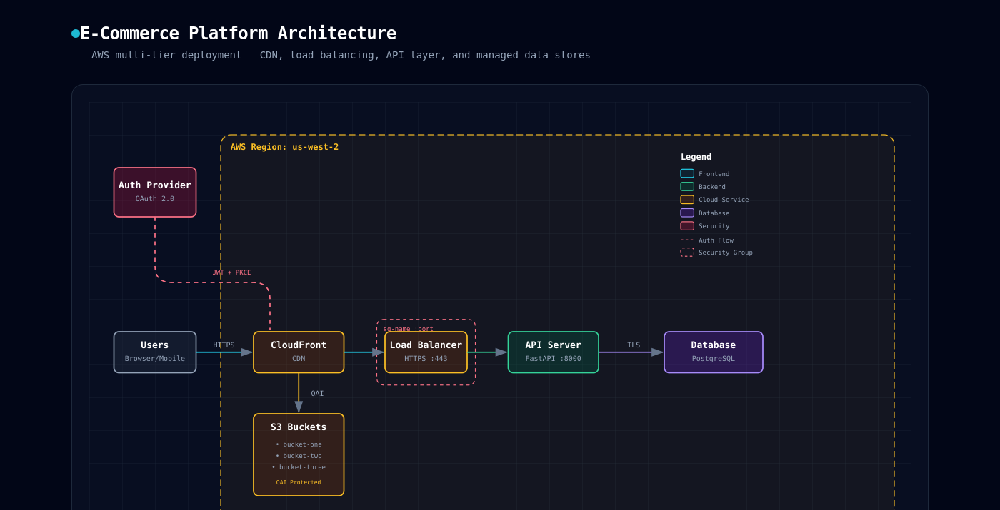

<p align="center">
  
</p>

<h1 align="center">🏗️ Architecture Diagram</h1>

<p align="center">
  <b>Turn a description of your system into a professional, dark-themed architecture diagram — a single self-contained HTML file, no tools or API keys required.</b>
</p>

<p align="center">
  
  
  
</p>

---

## 🧩 What problem does it solve?

Hand-building a clean, professional architecture diagram usually means wrestling with a drawing tool, and the result rarely looks consistent from one diagram to the next — colors drift, spacing is uneven, legends get forgotten.

**Architecture Diagram** generates the whole thing as a single HTML file with inline SVG, following a fixed dark, grid-backed design system: semantic colors per component type (frontend, backend, database, cloud, security), consistent typography, and clean arrow/boundary conventions — so every diagram it produces looks like part of the same set.

## ✨ What it does

| Step | Description |
|---|---|
| 1️⃣ **Describe** | You describe the system — components, connections, technologies |
| 2️⃣ **Map to the design system** | Each component is colored by type (frontend/backend/database/cloud/security) using a fixed palette |
| 3️⃣ **Lay out** | Boxes, arrows, security groups, and region boundaries are placed following consistent spacing and z-order rules |
| 4️⃣ **Generate** | A single self-contained `.html` file is written — opens in any browser, works offline |

<p align="center">
  
</p>

### Covers

- Software system architecture (frontend / backend / database layers)
- Cloud infrastructure (VPC, regions, subnets, managed services)
- Microservice / service-mesh topology
- Database + API maps, deployment diagrams

## 🚀 How to use it

1. Describe your system to Claude, or point it at a codebase to infer the architecture from.
2. Ask Claude to diagram it — for example:
   - *"Diagram this architecture"*
   - *"Draw our cloud infra"*
   - *"Visualize this microservice topology"*
3. Claude writes a single `.html` file following the design system below.
4. Open it in any browser — no dependencies, works offline.

## 🎨 Design system at a glance

| Component type | Color |
|---|---|
| Frontend | cyan |
| Backend | emerald |
| Database | violet |
| Cloud / managed service | amber |
| Security | rose |
| External | slate |

Background is a dark slate grid, typography is JetBrains Mono, and every diagram ends with a legend plus a row of summary cards underneath.

## 🗂️ Files in this skill

```
architecture-diagram/
├── SKILL.md              # Full design system, layout rules, and generation workflow
└── templates/
    └── template.html      # Working reference: every component type, arrow style, and the legend
```

## ✅ Best for

- Cloud/infra architecture reviews and onboarding docs
- System design write-ups that need a consistent visual language
- Microservice and service-mesh topology maps
- Anything with a tech-infra subject that fits a dark, grid-backed aesthetic

Not a fit for scientific diagrams, physical objects, floor plans, or hand-drawn-style sketches — those are better served by a more specialized skill.
