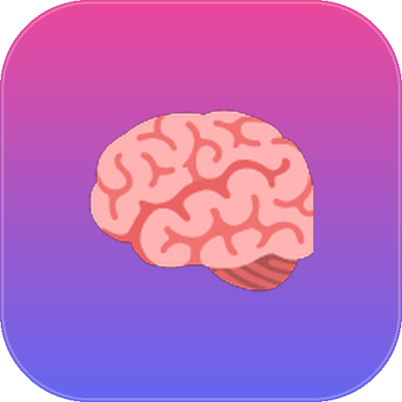

<p align="center">
  
</p>

<h1 align="center">🧠 Agent_Brain — Bio-Inspired AI Orchestration Framework</h1>

<p align="center">
  <b>A Python class skeleton that maps the functional neuroanatomy of the human cerebral cortex onto an AI agent's architecture.</b>
</p>

<p align="center">
  
  
  
  
</p>

<p align="center">
  
</p>

## 🧩 What problem does it solve?

Agent architectures tend to accumulate ad-hoc modules — a memory cache here, a watchdog there, a planner bolted on later — with no unifying mental model to reason about how the pieces relate. **Agent_Brain** solves that by borrowing a model that's already well understood: the functional division of labor across the human cerebral cortex. Every agent responsibility (vision/input intake, telemetry monitoring, memory retrieval, executive planning) maps to a named cortical lobe, giving the architecture a consistent, memorable vocabulary and a natural place for every new capability to live.

## 🏛️ How it's organized

| Biological structure | Class | Responsibility |
|---|---|---|
| 🧠 Cerebrum | `Agent_Brain` | Master controller; instantiates and coordinates both hemispheres |
| 🌗 Cerebral Hemispheres | `ProcessingPipeline` | Symmetrical Left/Right dual execution pipelines |
| 🧩 Frontal Lobe | `CognitiveFunctions` | Planning, reasoning, honesty/deception dials, pre-speech rehearsal, voluntary action |
| 📡 Parietal Lobe | `ProcessMonitor` | Telemetry, exception discrimination, "pain reflex" loop watchdog |
| 📚 Temporal Lobe | `KnowledgeRetriever` | Language parsing + tiered L1/L2/L3 memory (sensory cache → episodic → persistent RAG) |
| 👀 Occipital Lobe | `Vision_and_hearing` | Multimodal input intake, compute-budget estimation |
| 🌉 Corpus Callosum | `cross_pipeline_link` | Synchronizes the two hemispheres, or isolates them for split-brain diagnostics |

The two hemispheres run in parallel and can cross-validate each other's conclusions before a response is finalized — a built-in second opinion.

## 🚀 How to use it

```python
from brain_anatomy import Agent_Brain

# Instantiate a highly critical, hyper-logical "Auditor" brain profile
auditor_brain = Agent_Brain(
    cross_pipeline_link=True,             # Synchronized parallel validation (Corpus Callosum)
    iq_reasoning_depth=160,               # Deep logical reasoning passes
    level_of_judgement=1.0,               # Blunt, honest evaluation (no sycophancy)
    honesty_threshold=1.0,                # Maximum factual grounding
    deception=0.0,                        # Zero strategic obfuscation
    personality_style="Strict Inspector",
    log_discrimination=0.9,               # Fine-grained warning/error discrimination
    retrieval_similarity_threshold=0.85,  # High-precision memory recall
    linguistic_syntax_precision=0.95,     # Strict schema/code validation
    prompt_optimization_passes=3,         # Recursive prompt optimization
    l1_context_count_limit=1_000_000,
    l2_context_count_limit=5_000_000,
    l3_context_count_limit=50_000_000,
)
```

Every constructor parameter is a "behavioral dial" — tune reasoning depth, honesty, memory tier sizes, and personality independently to produce a differently-configured agent from the same skeleton.

## 🗂️ Files in this project

```
brain-anatomy/
├── brain_anatomy.py     # Latest implementation (v18_pass) — start here
├── versions/            # Full iteration history, v1 → v18_pass
├── pyproject.toml
└── docs/
    ├── readme.md                        # Deep-dive: all 10 UML/Mermaid diagrams
    ├── terminologies.md                 # Biological → programmatic glossary
    ├── comments.md                      # Line-by-line code walkthrough
    ├── classdiagram.md / codeblock.md   # Supporting design references
    ├── evolution.md                     # Chronological design iteration log
    └── ideas.md, phd-research-proposal.md, creative-brainstorming-profile.yaml
```

## 📊 Diagrams

`docs/readme.md` contains the full set of 10 Mermaid diagrams tracing the system from every angle: class diagram, sequence diagram, context diagram, component/architecture diagram, activity diagram, two data-flow diagrams (Level 0 & 1), an entity-relationship diagram, a use-case diagram, and a state machine diagram — [see it here](docs/readme.md).

## ✅ Best for

- Studying a worked example of mapping a real-world mental model onto a class architecture
- A starting skeleton for building a multi-module agent with built-in telemetry, tiered memory, and a self-review gate
- Teaching / reference material for system design and UML documentation practices

## ⚠️ Note

This is a **skeleton framework** — method bodies are stubs (`pass`) meant to illustrate structure and naming conventions, not a production-ready runtime. Fill in the logic for your own use case.
