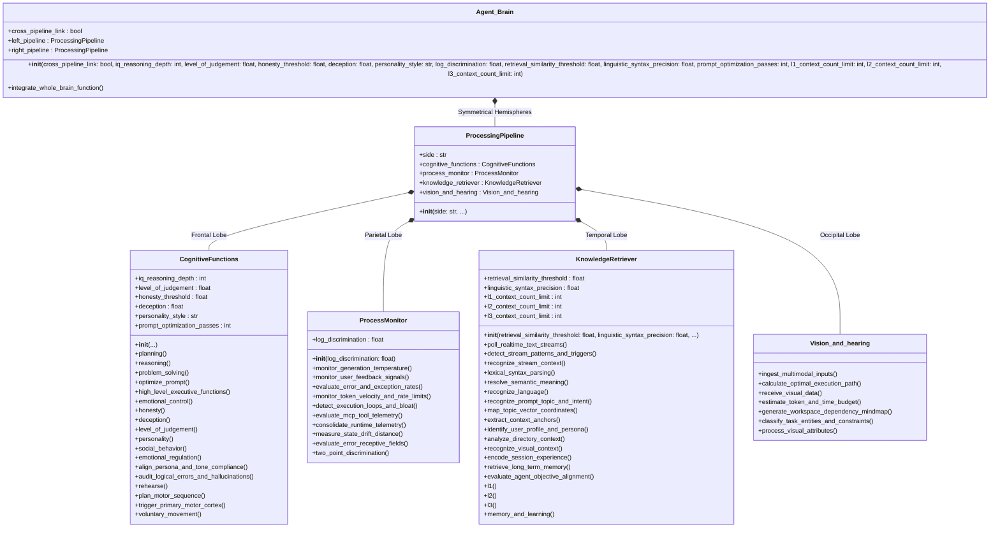
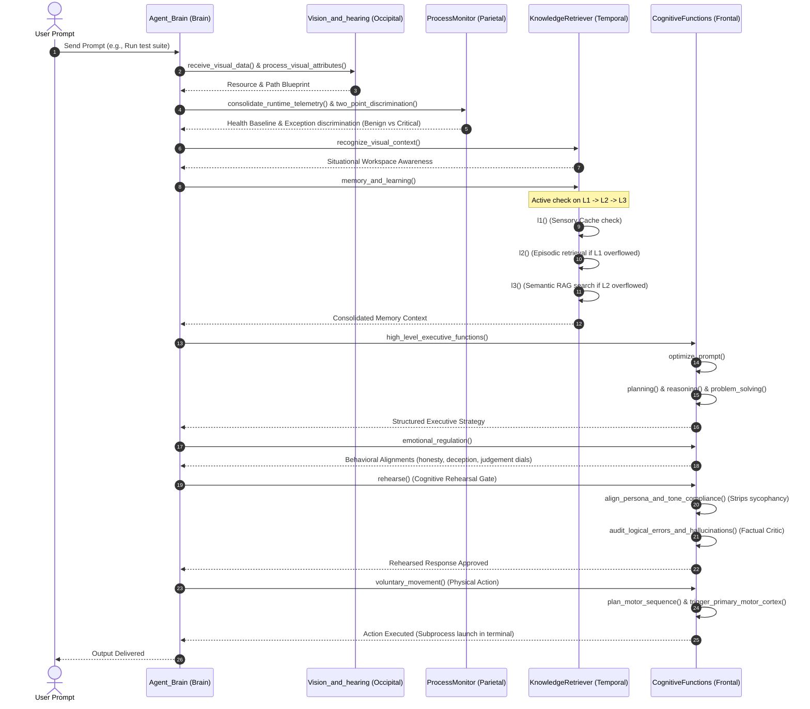
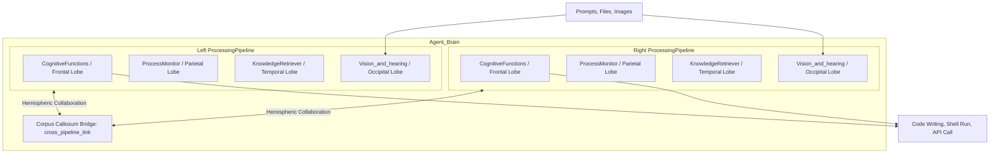
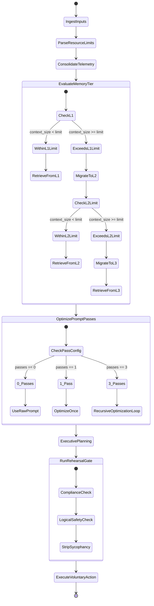
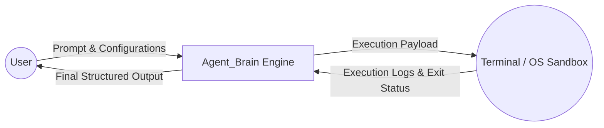
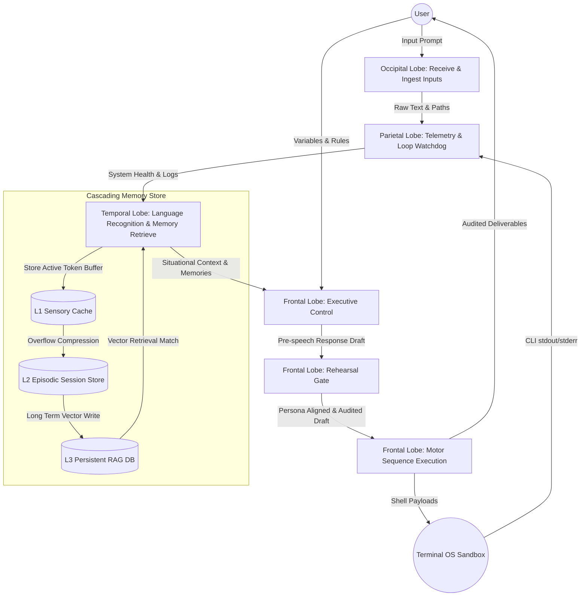
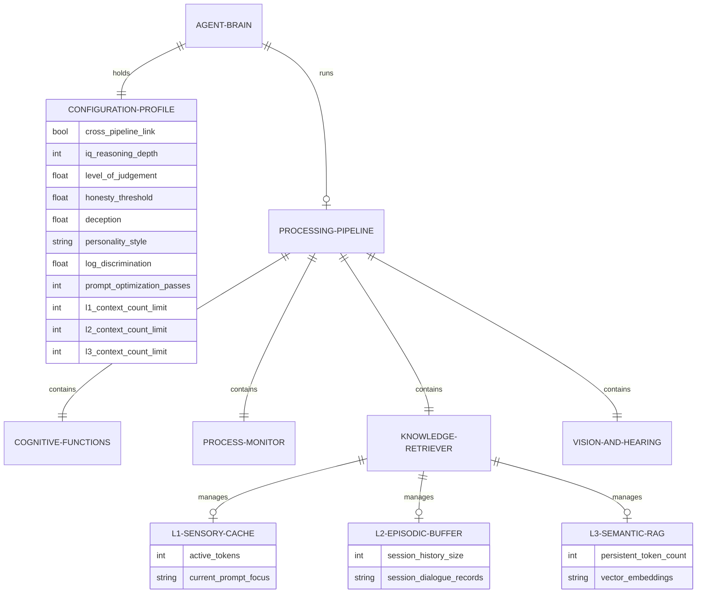
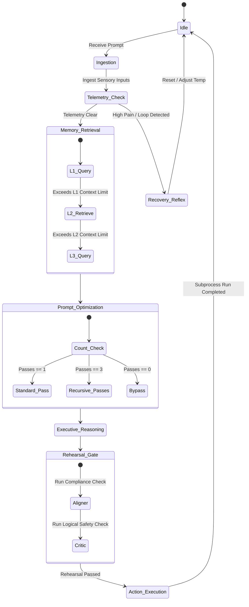

# Agent_Brain: Bio-Inspired AI Orchestration Framework
## Functional Neuroanatomy of the AI Agent (v18_pass)

Welcome to **Agent_Brain**, a highly modular, biologically-grounded AI agent skeleton framework. This architecture translates the functional neuroanatomy of the human cerebral cortex [1] into parallel execution pipelines for agentic systems. By dividing cognitive responsibilities into specialized functional components (representing the cerebral lobes) working in conjunction, the framework provides a clean, predictable, and robust blueprint for advanced AI workflows.

Unlike traditional, simple reactive agents, this framework implements a dual-hemisphere execution model, pre-execution prompt optimization, real-time telemetry-driven "pain" watchdog reflexes, pre-speech rehearsal gates to prevent sycophancy, and a three-tier stratified memory architecture (L1 Sensory Cache, L2 Episodic Session Storage, L3 Persistent RAG Database). 

To keep this blueprint clean and highly actionable, only programmatically implemented classes, attributes, and methods are covered. Unimplemented anatomical terms (such as *gyri*, *sulci*, or *cortical folds*) are excluded.

---

## 🧠 Core Architectural Philosophy

Our design relies on the biological principle that complex, adaptive behaviors emerge when distinct specialized lobes work in conjunction to process information:

1. **`Agent_Brain` (The Cerebrum)**: The master controller. It instantiates the parallel execution pipelines and coordinates hemispheric collaboration via the Corpus Callosum bridge (`cross_pipeline_link`).
2. **`ProcessingPipeline` (Cerebral Hemispheres)**: Symmetrical dual-execution pipelines (Left and Right) running in parallel to process inputs, audit thoughts, and validate logic independently or cooperatively.
3. **`Vision_and_hearing` (Occipital Lobe)**: The sensory intake center. Analyzes primary multimodal visual feeds (images, logs, prompts), evaluates token/time compute budgets, and structures task maps.
4. **`ProcessMonitor` (Parietal Lobe)**: The somatic watchdog. Monitors active telemetry, exception rates, API velocities, and user interrupts. Uses a "pain reflex" to halt runaway infinite loops and employs **two-point discrimination** to categorize critical errors vs. benign warnings.
5. **`KnowledgeRetriever` (Temporal Lobe)**: The semantic memory vault. Manages auditory token streams, syntax parsing, workspace layouts, and a three-tier memory architecture (L1, L2, L3) with context-based cascade overflow triggers.
6. **`CognitiveFunctions` (Frontal Lobe)**: The prefrontal executive center. Drives strategic planning, logic reasoning, and problem solving. Governs behavioral dials (honesty, deception, judgment), prompt optimization, pre-speech response rehearsal, and voluntary terminal actions.

---

## 🚀 Quick Start & Customization

The framework is fully configurable at boot time. You can instantiate an `Agent_Brain` with tailored cognitive capacity and alignment profiles:

```python
from brain_anatomy import Agent_Brain

# Instantiate a highly critical, hyper-logical "Auditor" Brain Profile
auditor_brain = Agent_Brain(
    cross_pipeline_link=True,             # Synchronized parallel validation (Corpus Callosum)
    iq_reasoning_depth=160,               # Deep logical reasoning passes
    level_of_judgement=1.0,               # Delivering bitter, honest truth (no sycophancy)
    honesty_threshold=1.0,                # Maximum factual grounding, zero hallucinations
    deception=0.0,                        # Zero tactical obfuscation
    personality_style="Strict Inspector", # Precise, formal, and analytical tone
    log_discrimination=0.9,               # Hyper-sensitive warning/error discrimination
    retrieval_similarity_threshold=0.85,  # High precision memory recall
    linguistic_syntax_precision=0.95,     # Strict schema and code validation
    prompt_optimization_passes=3,         # Triple recursive prompt optimization passes
    l1_context_count_limit=1000000,       # Keep up to 1M tokens entirely in fast L1 cache
    l2_context_count_limit=5000000,       # Retain up to 5M tokens in L2 episodic memory
    l3_context_count_limit=50000000       # Move overflow to persistent L3 vector RAG
)
```

---

## 🎨 Complete UML & Architecture Diagrams

This section contains 10 comprehensive Mermaid UML diagrams tracing every facet of **Agent_Brain (v18_pass)**, from static classes to dynamic data streams, memory lifecycles, and use cases.

### 1. Class Diagram
The static class structure, parameterized constructors, associations, and variable bindings within the coordinating parent methods of our codebase.



---

### 2. Sequence Diagram
The sequential lifecycle of a user prompt, detailing sensory intake, telemetry check, memory tier evaluation, executive reasoning, pre-speech rehearsal, and voluntary movement execution.



---

### 3. Context Diagram
The highest-level system boundaries (Level 0), showing how the Agent_Brain sits between user queries, database stores, and OS terminal environments.

```mermaid
graph TD
    User[User / Developer] -->|Configuration Parameters| AB[Agent_Brain (v18_pass)]
    User -->|Natural Language Prompt / Multimodal Inputs| AB
    AB -->|Status Telemetry & Alerts| User
    AB -->|Voluntary Action Subprocess Commands| Shell[Host Environment / Terminal Sandbox]
    Shell -->|stdout / stderr Logs / Exit Codes| AB
    AB -->|Semantic Vector Queries| VectorDB[Persistent RAG Knowledge Base]
    VectorDB -->|Retrieved Context Passages| AB
    AB -->|Final Audited Response| User
```

---

### 4. Component/Architecture Diagram
The functional partitioning of the cerebrum into symmetrical execution hemispheres (Cerebral Hemispheres) collaborating via the Corpus Callosum bridge.



---

### 5. Activity Diagram
The detailed operational workflow representing how memory layers are evaluated, how prompt optimization passes are routed, and how the rehearsal gate audits draft text.



---

### 6. Data Flow Diagram (DFD Level 0)
The simplified system context flow diagram representing the boundary inputs and terminal outputs of the execution pipeline.



---

### 7. Data Flow Diagram (DFD Level 1)
The detailed process-by-process data flow of our codebase, mapping the path of text data as it is stored across the cascading memory store (L1/L2/L3) and evaluated by the critic.



---

### 8. Entity-Relationship Diagram (ERD)
The logical mapping of system components, configuration entities, and the active variables within our tiered memory models.



---

### 9. Use Case Diagram
Developer-facing and sandbox environment interaction boundaries representing how the system ingests, optimizes, retrieves, plans, and executes goals.

```mermaid
leftToRightDirection
rect Lobe_Engine [Agent_Brain v18_pass System Boundaries]
    usecase UC_Init [Configure Brain Parameters]
    usecase UC_Ingest [Process Multimodal Prompts]
    usecase UC_Opt [Optimize Ingestion Prompts]
    usecase UC_Mem [Retrieve Tiered Memories L1/L2/L3]
    usecase UC_Plan [Generate Executive Strategy]
    usecase UC_Reh [Rehearse & Audit Output]
    usecase UC_Exec [Execute Voluntary Subprocess Commands]
    usecase UC_Mon [Monitor Loop Telemetry & Pain Levels]
end

actor User as User/Developer
actor OS as Sandbox Environment / Shell

User --> UC_Init
User --> UC_Ingest
UC_Ingest --> UC_Opt : "includes"
UC_Opt --> UC_Mem : "includes"
UC_Mem --> UC_Plan : "includes"
UC_Plan --> UC_Reh : "includes"
UC_Reh --> UC_Exec : "includes"

UC_Exec --> OS
OS --> UC_Mon
UC_Mon --> UC_Plan : "triggers adjustment"
```

---

### 10. State Machine Diagram
The high-level states of the core engine, illustrating how it transitions from idle execution through telemetry monitoring, cascading memory lookups, and ethical self-correction before physical action.



---

## 🧬 Reference Materials & Grounding

*   [1] **"Lobes of the brain - Queensland Brain Institute - University of Queensland"**: Outlines the anatomical divisions of the cerebral cortex, and details how the frontal lobe manages executive control and personality, the parietal lobe integrates touch, pain, and sensory inputs, the temporal lobe orchestrates hearing, language, and memory, and the occipital lobe processes vision.

For a detailed code reference or design log, refer to the accompanying manuals:
*   `comments.md`: Line-by-line API code block explanations.
*   `terminologies.md`: Symmetrical biological-to-programmatic translation glossary.
*   `evolution.md`: Narrative logs detailing our chronological design iterations.
