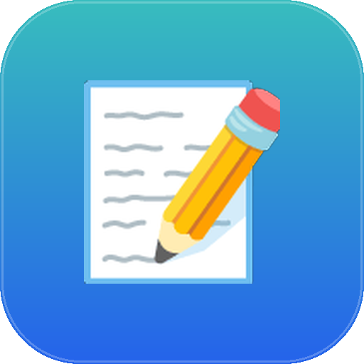
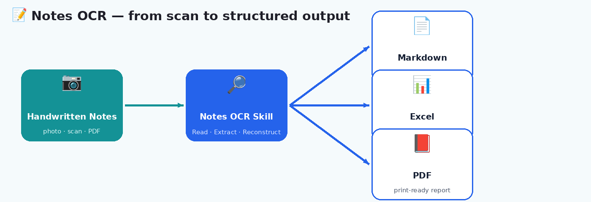

<p align="center">
  
</p>

<h1 align="center">📝 Notes OCR</h1>

<p align="center">
  <b>Turn a photo of your messy handwritten notes into a clean Markdown doc, an Excel workbook, and a print-ready PDF — automatically.</b>
</p>

<p align="center">
  
  
  
</p>

---

## 🧩 What problem does it solve?

We all have a pile of handwritten notes — meeting scribbles, whiteboard photos, lecture pages, architecture sketches — that never get organized because typing them up is tedious. Hand‑drawn diagrams are the worst part: flowcharts, entity maps, and org charts are nearly impossible to "clean up" by hand.

**Notes OCR** reads a scan, PDF, or photo of handwritten content and reconstructs it into three ready-to-use documents in one pass — including faithfully rebuilding every hand-drawn diagram as a real, editable Mermaid diagram, not a vague paraphrase.

## ✨ What it does

| Step | Description |
|---|---|
| 1️⃣ **Read & Extract** | Parses every line of text, table, list, and diagram from the image/PDF, page by page |
| 2️⃣ **Reconstruct Diagrams** | Converts hand-drawn flowcharts, entity maps, ERDs, and org charts into faithful Mermaid syntax — same nodes, same arrows, same labels |
| 3️⃣ **Structure Content** | Organizes everything into logical sections with a table of contents |
| 4️⃣ **Generate Outputs** | Produces all three deliverables in parallel: Markdown, Excel, and PDF |

<p align="center">
  
</p>

### Output breakdown

- **📄 Markdown** — full document with inline Mermaid diagram blocks placed exactly where they appeared in the notes, plus GFM tables
- **📊 Excel** — one sheet per section (professional styling: header fills, borders, alternating rows), plus a dedicated Diagrams sheet
- **📕 PDF** — title page, table of contents, section pages, styled tables, and diagram callouts — print-ready

## 🚀 How to use it

1. Upload a photo, scan, or PDF of your handwritten notes to Claude.
2. Ask Claude to digitize, transcribe, or "clean up" the notes — for example:
   - *"Digitize my notes"*
   - *"Turn this scan into a doc"*
   - *"OCR this and make it clean"*
   - *"My notes have diagrams, convert them"*
3. Claude reads the content, rebuilds every diagram faithfully in Mermaid, and generates all three files.
4. You get Markdown + Excel + PDF, ready to download.

> By default all three outputs are produced. Just ask for "only the PDF" (or any subset) if that's all you need.

## 🗂️ Files in this skill

```
notes-ocr/
├── SKILL.md              # Full skill instructions (extraction rules, Mermaid mapping, templates)
└── scripts/
    ├── build_excel.py     # Reusable Excel builder (openpyxl, professional styling)
    ├── build_pdf.py        # Reusable PDF builder (reportlab, professional styling)
    ├── quick_validate.py   # Sanity checks on generated output
    ├── package_skill.py    # Packaging helper
    └── utils.py             # Shared helpers
```

## 🧠 Diagram fidelity rules (the important part)

The skill is strict about **not inventing** what wasn't drawn:

- Preserves the exact topology — if `A → B → C` in the notes, that's exactly what's written
- Preserves labels verbatim (field names, type annotations, arrow labels)
- Never adds nodes or arrows that weren't in the original sketch
- Never simplifies — if 4 items were drawn, all 4 appear

| Hand-drawn shape | Mermaid type used |
|---|---|
| Boxes + arrows | `graph TD` / `graph LR` |
| Entity boxes with fields | `erDiagram` or `graph TD` with subgraphs |
| Hierarchy / tree | `graph TD` |
| Sequential steps | `flowchart TD` |
| Database relationships | `erDiagram` |

## ✅ Best for

- Meeting and lecture notes
- Whiteboard photos with flowcharts or architecture sketches
- Handwritten project plans and specs
- Scanned multi-page documents that need to become searchable, structured files
