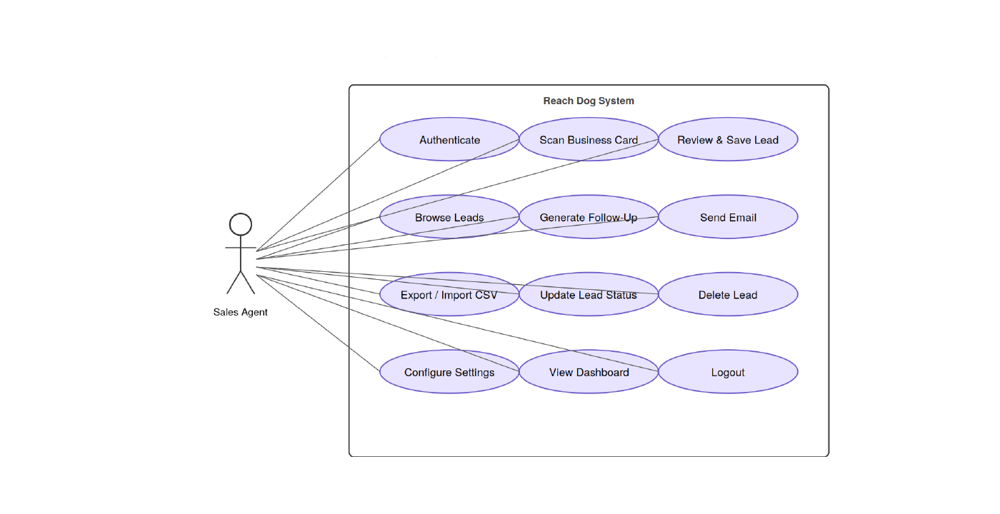

<p align="center">
  
</p>

<h1 align="center">📐 System Analysis & Design</h1>

<p align="center">
  <b>Turn a project idea into an exam-quality SRS + system-design document — or turn an existing codebase into an evidence-based, scored audit.</b>
</p>

<p align="center">
  
  
  
</p>

---

## 🧩 What problem does it solve?

Writing a rigorous System Requirements Specification by hand is slow, and it's easy to skip the parts that make it defensible — a traceability matrix, a design-rationale section, diagrams that are actually correct UML instead of a vague box-and-arrow sketch. Grading an existing codebase against real computer-science principles (rather than a vibe check) has the same problem: without a fixed rubric and evidence requirements, "code quality" scores aren't comparable or trustworthy.

**System Analysis & Design** runs two distinct, rigorous workflows:

1. **SRS generation** — elicits the missing details of a project idea, then drafts a complete, academic-grade SRS + system-design document with all 14 sections and every standard diagram type.
2. **Code audit** — scores an existing codebase against the PAOS Code Audit Framework v2.0: 110 questions across 13 categories, each requiring `file:line` evidence, producing a normalized grade and a phased gaps/implementation plan.

## ✨ What it does

### SRS generation flow

| Step | Description |
|---|---|
| 1️⃣ **Elicit** | Interviews you on the project's critical unknowns before writing anything — no invented requirements |
| 2️⃣ **Draft** | Fills all 14 sections (Introduction → References) following the canonical SRS template |
| 3️⃣ **Diagram** | Renders every UML diagram type, ERD, DFD, and context diagrams for both MVP and Scalable tiers |
| 4️⃣ **Build** | Produces the final Markdown + print-ready PDF, with a Requirements Traceability Matrix and Design Rationale section |

<p align="center">
  
</p>

### Code audit flow

| Step | Description |
|---|---|
| 1️⃣ **Benchmark** | Scores 110 questions (0/1/2, evidence required) across OOP, Data Structures, Security, Database, and 9 more categories |
| 2️⃣ **Grade** | Normalizes to a 0–100 score with letter grade (A–F), with an auto-downgrade if any starred question scores 0 |
| 3️⃣ **Gap out** | Writes an individual gap file + a combined `gaps.md` for every question scoring below full marks, each with severity, fix, and acceptance criteria |
| 4️⃣ **Plan** | Produces a 4-phase implementation plan (Security → Data Integrity → Code Quality → API & Analytics) — never auto-executed without explicit sign-off |

## 🚀 How to use it

**For an SRS:**
- *"Write an SRS for this project"*
- *"Design this system for me"*

Claude interviews you on the critical unknowns first, then drafts the full document.

**For a code audit:**
- *"Audit this codebase"*
- *"Benchmark the code"*
- *"Grade the project"*

Claude never starts fixing anything on its own — implementation only begins if you explicitly say *"work on gap N"*.

## 🗂️ Files in this skill

```
system-analysis-and-design/
├── SKILL.md                          # Full workflow: SRS generation + 3-phase code audit
├── AGENTS.md                         # Agent-facing operating notes
├── assets/
│   ├── elicitation-survey.md          # Interview checklist (Critical vs Important questions)
│   └── usecase-template.svg           # Hand-crafted UML use-case template (avoids Mermaid pitfalls)
└── references/
    ├── srs-template.md                 # Canonical 14-section SRS structure
    ├── elicitation-workflow.md         # Full interview flow
    ├── diagram-cookbook.md             # Correct Mermaid syntax + known rendering pitfalls
    ├── pdf-build-guide.md              # pandoc + xelatex + mermaid-cli build sequence
    ├── coding-principles.md            # PAOS Code Audit Framework reference
    ├── coding-principles-benchmark.md  # The 110-question scored benchmark
    ├── swot-benchmark.md               # 31-question SWOT/investment benchmark
    ├── benchmark-dashboard.md          # Kanban / benchmark tracking reference
    └── example-reachdog-srs.{md,pdf}   # Full worked example SRS document
```

## ✅ Best for

- Course projects and capstones that need a defensible, complete SRS
- System design documents that need correct UML (not approximations)
- Codebase audits that need a comparable, evidence-based score instead of a subjective review
- Turning audit gaps into a phased, prioritized implementation plan
