# Diagram Cookbook

Correct Mermaid syntax for every diagram type in the SRS, plus the known pitfalls and workarounds learned from real rendering failures.

## Golden Rules

1. **Check aspect ratio of every rendered diagram.** If height/width > 1.5, the diagram will span multiple pages in the PDF. Rewrite it horizontally (`LR` instead of `TD`/`TB`).
2. **Render with `-w 1600` in mmdc.** Smaller widths produce cramped diagrams; larger widths waste PDF space.
3. **Never put `+` after a number in a labeled arrow.** `-. TLS 1.2+ .->` breaks Mermaid's lexer. Use `-. "TLS" .->` with quotes.
4. **`PK_FK` breaks ER diagrams.** Use `PK` alone; add a note that the field is also a foreign key in prose.
5. **Use-case diagrams with `((circles))` produce page-spanning output.** Use the hand-crafted SVG template instead.

---

## Context Diagram

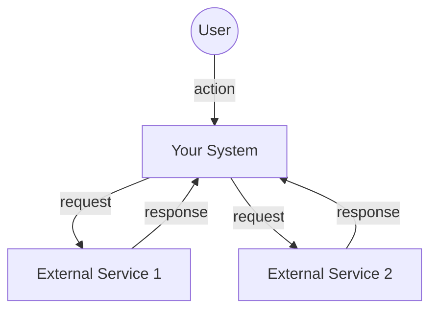

---

## DFD Level 0

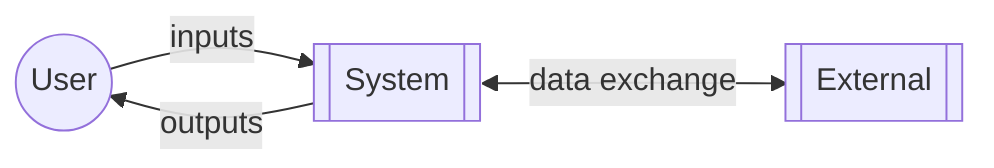

## DFD Level 1

Use `flowchart LR` with numbered process bubbles `[[1.0 Process Name]]` and cylinder data stores `[(D1: Store Name)]`.

---

## Entity-Relationship Diagram

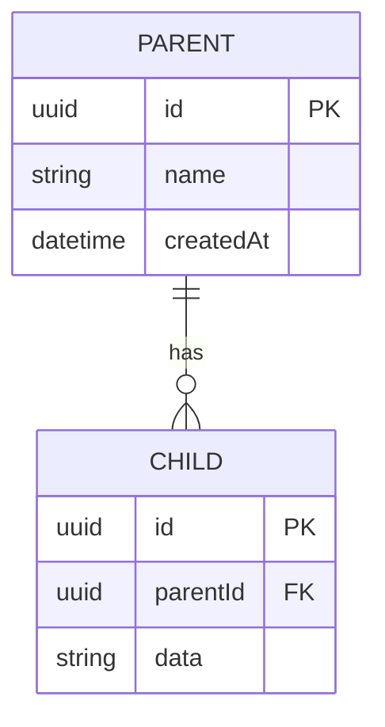

Cardinality reference:
- `||--||` one-to-one
- `||--o{` one-to-many
- `}o--o{` many-to-many
- `||--o|` one-to-zero-or-one

---

## Class Diagram

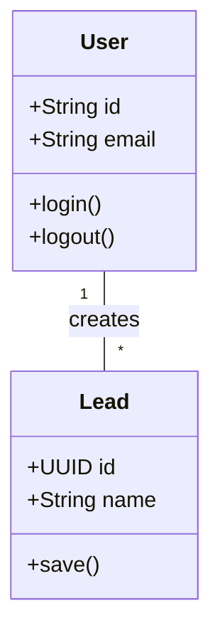

---

## Sequence Diagram

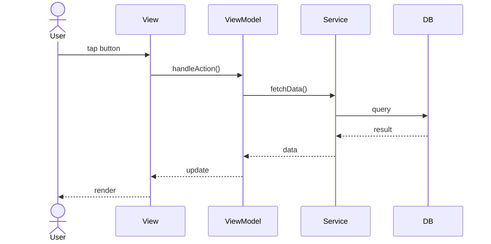

---

## State Machine Diagram

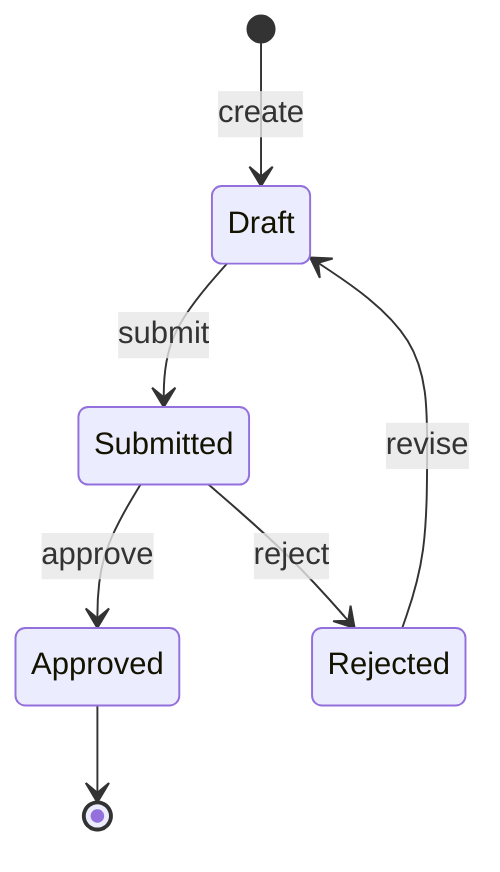

---

## Activity Diagram (use horizontal layout for PDF-friendly output)

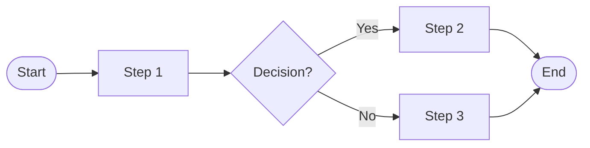

## Flowchart (Exhaustive Decision Tree)

Distinct from Activity Diagram. Every `if` statement is a diamond. Keep compact with LR direction and short node labels.

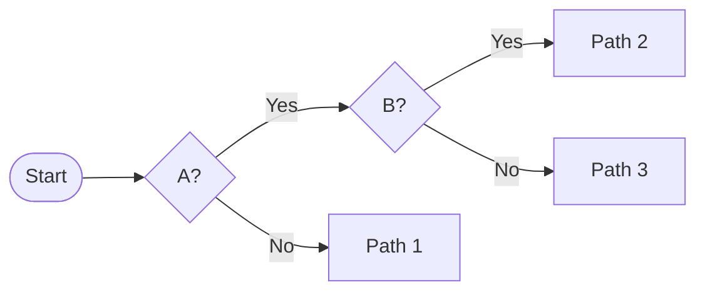

---

## Use Case Diagram — USE SVG, NOT MERMAID

The Mermaid `flowchart` engine renders `((Use Case))` circles at ~200px each. With 10+ use cases, the diagram becomes 2000+ pixels tall and spans 3-4 pages in the PDF.

Use the SVG template at `../assets/usecase-template.svg`. Copy it, edit the text and coordinates for your use cases, then render with:

```bash
python3 -c "import cairosvg; cairosvg.svg2png(url='in.svg', write_to='out.png', output_width=1600)"
```

Result: a proper UML use case diagram — stick-figure actor on the left, ellipse use cases in a grid, system boundary box, association lines. Fits one page.

---

## Component Diagram

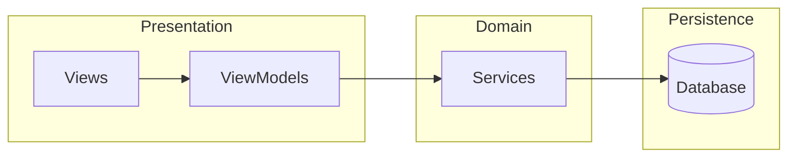

## Deployment Diagram

Compose with `subgraph` blocks representing physical nodes (devices, servers, clouds). Use dotted arrows `-.->` for network connections with simple labels in quotes.

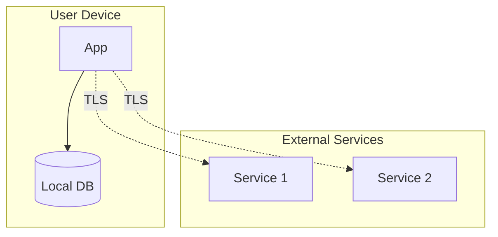

---

## Package Diagram

Keep compact. If using nested subgraphs, use `direction TB` inside an outer `flowchart LR` so packages stack vertically within a horizontally-laid-out diagram.

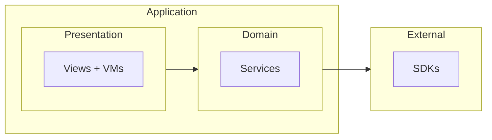

---

## Object Diagram — Runtime Snapshot

Concrete instances with actual values. Use `flowchart TB` with boxes containing multi-line values.

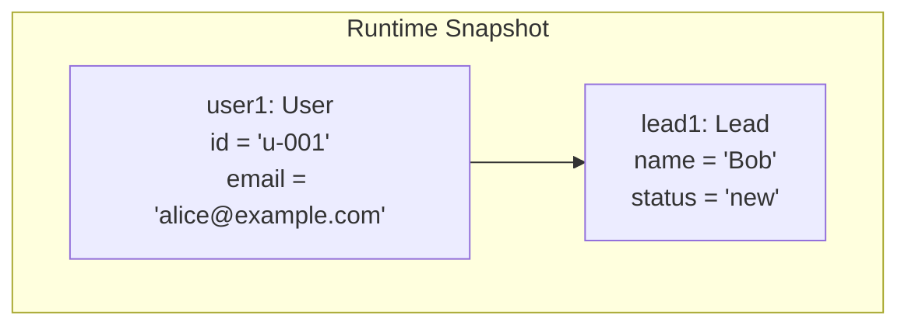

---

## Communication Diagram

Use numbered messages on a simple `flowchart LR` with bidirectional labeled arrows.

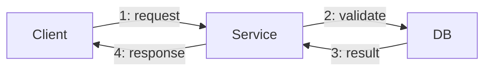

---

## Interaction Overview Diagram

Composition of multiple sub-flows. Use `flowchart TD` with `ref:` prefixed nodes indicating references to other diagrams.

---

## Timing Diagram

Gantt-style is simplest:

```mermaid
gantt
    title Task Timing
    dateFormat ss
    axisFormat %S
    section User
    Action 1 :0, 2
    Action 2 :3, 2
    section System
    Process :1, 3
```

---

## Gantt Chart (Project Timeline)

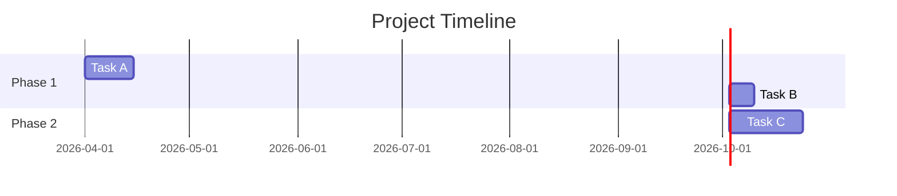

---

## Rendering Commands

```bash
# Single diagram
mmdc -i input.mmd -o output.png -b white -w 1600

# All diagrams in a folder
for f in diagrams/*.mmd; do
  mmdc -i "$f" -o "${f%.mmd}.png" -b white -w 1600
done

# With puppeteer config for sandboxed environments
mmdc -i in.mmd -o out.png -b white -w 1600 -p puppeteer.config.json
```

Puppeteer config for headless containers:

```json
{
  "args": ["--no-sandbox", "--disable-setuid-sandbox", "--disable-dev-shm-usage"]
}
```

---

## Aspect Ratio Check

After rendering, always run this check:

```python
from PIL import Image
import os
for p in sorted(os.listdir('diagrams')):
    if p.endswith('.png'):
        img = Image.open(f'diagrams/{p}')
        w, h = img.size
        ratio = h/w
        flag = " ⚠️ TALL" if ratio > 1.5 else ""
        print(f"{p}: {w}x{h} h/w={ratio:.2f}{flag}")
```

Any diagram flagged TALL must be rewritten. Non-negotiable.
