\newpage

# 1. Introduction

## 1.1 Purpose

This document is the complete System Requirements Specification (SRS) and system design for **Reach Dog**, an iOS-native CRM application built for sales professionals who capture leads at in-person events. It covers both the MVP and the scalable production version. It serves as the single source of truth for developers, testers, and stakeholders.

## 1.2 Scope

Reach Dog is a native iOS application that reduces the time from "business card in hand" to "follow-up email drafted" from hours to seconds. It combines on-device OCR, LLM-powered email generation (Gemini Flash API), and a local-first lead management workspace.

**In scope:** iOS-native app, Apple/Google sign-in, on-device OCR, AI follow-up generation, lead management, email dispatch via URL schemes, CSV import/export, dashboard analytics.

**Out of scope:** Android, web app, desktop app, full email client, SMTP sending, bidirectional CRM integration (Salesforce, HubSpot), company-operated backend (MVP).

## 1.3 Definitions, Acronyms, Abbreviations

| Term | Definition |
|---|---|
| CRM | Customer Relationship Management |
| MVP | Minimum Viable Product |
| OCR | Optical Character Recognition |
| LLM | Large Language Model |
| OAuth 2.0 | Open Authorization protocol, RFC 6749 |
| JWT | JSON Web Token, RFC 7519 |
| SwiftData | Apple's declarative persistence framework |
| Vision | Apple's on-device computer-vision framework |
| Keychain | Apple's secure credential-storage service |
| CloudKit | Apple's cloud-persistence framework |
| MVVM | Model-View-ViewModel architectural pattern |
| DFD | Data-Flow Diagram |
| ERD | Entity-Relationship Diagram |
| TLS | Transport Layer Security |
| HIG | Apple Human Interface Guidelines |
| URL Scheme | Inter-application communication mechanism on iOS |
| Lead | A prospective customer captured within the application |
| ATS | App Transport Security |
| AES | Advanced Encryption Standard |

## 1.4 References

- IEEE Std 830-1998: Recommended Practice for Software Requirements Specifications
- RFC 6749: The OAuth 2.0 Authorization Framework
- RFC 7519: JSON Web Token (JWT)
- Apple Inc., AuthenticationServices Framework Reference, 2025
- Apple Inc., Vision Framework Reference, 2025
- Apple Inc., SwiftData Programming Guide, 2025
- Apple Inc., CloudKit Framework Reference, 2025
- Apple Inc., Human Interface Guidelines — iOS, 2025
- Google LLC, Gemini API Documentation (Flash Tier), 2026
- Google LLC, GoogleSignIn-iOS SDK Reference, 2026

## 1.5 Document Overview

| Section | Content |
|---|---|
| 1 | Introduction |
| 2 | Literature Review |
| 3 | SWOT and PESTLE Analysis |
| 4 | Planning Phase |
| 5 | Methodology |
| 6 | Functional and Non-Functional Requirements |
| 7 | Process and Data Modelling |
| 8 | System Design |
| 9 | UML Diagrams (all 11 types) |
| 10 | MVP Design |
| 11 | Testing |
| 12 | Deployment Plan |
| 13 | Maintenance Plan |
| 14 | References |

\newpage

# 2. Literature Review

## 2.1 Existing Solutions

| Tool | Strengths | Weaknesses (vs Reach Dog's use case) |
|---|---|---|
| **Salesforce Mobile** | Full CRM, enterprise features | Overkill for individual reps; no OCR; high cost |
| **HubSpot CRM** | Free tier, web-based | No native OCR; requires web connectivity; not iOS-native |
| **CamCard** | Business card OCR | No AI follow-up; no lead pipeline; dated UI |
| **Covve** | Contact management + card scan | No AI email drafting; limited pipeline |
| **Apple Contacts** | Built-in, free | No CRM pipeline; no AI; no follow-up workflow |

## 2.2 Gap Identified

No existing tool combines **on-device OCR + AI-generated personalised follow-up emails + lead pipeline management** in a single native iOS app with local-first data ownership. Reach Dog fills this gap by targeting the specific workflow: scan card → draft email → send — in under 60 seconds.

\newpage

# 3. Analysis Frameworks

## 3.1 SWOT Analysis

| | Positive | Negative |
|---|---|---|
| **Internal** | **Strengths:** Local-first (privacy by design), on-device OCR (no cloud dependency), AI-powered drafts, iOS-native performance, zero backend cost for MVP | **Weaknesses:** iOS-only, Gemini API dependency, no offline AI, single-developer team |
| **External** | **Opportunities:** Growing sales-tech market, Apple ecosystem expansion (iPadOS/macOS), on-device LLMs maturing, potential B2B team features | **Threats:** Apple/Google could add similar features natively, Gemini API pricing changes, App Store review delays |

## 3.2 PESTLE Analysis

| Factor | Impact |
|---|---|
| **Political** | Low — consumer app, no regulated industry |
| **Economic** | Freemium model viable; Gemini Flash API cost is per-call and low |
| **Social** | Remote/hybrid work increases trade-show networking value |
| **Technological** | Swift 6, SwiftUI, Vision framework, on-device ML all mature |
| **Legal** | GDPR compliance required (data minimisation already built-in); App Store guidelines |
| **Environmental** | Minimal — local-first reduces cloud compute carbon footprint |

\newpage

# 4. Planning Phase

## 4.1 Problem Statement

Sales professionals lose lead quality between first contact at events and follow-up emails. Manual composition from business cards is slow, leading to cold, delayed outreach with lower conversion rates.

## 4.2 Project Objectives

| # | Objective | Metric |
|---|---|---|
| O1 | Reduce card-to-email time | < 60 seconds |
| O2 | Achieve accurate OCR extraction | > 85% field accuracy |
| O3 | Generate usable AI drafts | User edits < 20% of generated text |
| O4 | Zero backend cost for MVP | $0 infrastructure spend |
| O5 | Ship MVP to TestFlight | Within 8 weeks |

## 4.3 Project Charter

| Item | Detail |
|---|---|
| **Project Title** | Reach Dog — AI-Powered Sales Lead CRM |
| **Sponsor** | Reach Dog Project Team |
| **Start Date** | April 2026 |
| **Target MVP** | June 2026 |
| **Target Scalable** | Q4 2026 |
| **Deliverables** | iOS app (MVP), SRS document, test report |

## 4.4 Project Scope

**In-scope (MVP):** Authentication (Apple/Google), OCR scan, lead CRUD, AI follow-up, email via URL schemes, CSV export/import, dashboard.

**In-scope (Scalable):** iCloud sync, Gmail API send, team workspaces, custom pipeline, reminders, advanced analytics.

**Out-of-scope:** Android, web, desktop, full email client, third-party CRM sync.

## 4.5 Stakeholder Analysis

| Stakeholder | Role | Interest |
|---|---|---|
| Sales Agent | Primary user | Scan cards, generate emails, manage leads |
| Sales Manager | Scalable user | View team dashboard, monitor pipeline |
| Team Administrator | Scalable user | Manage team, shared templates, pipeline config |
| Developer | Builder | Technical implementation |
| App Store Reviewer | Gatekeeper | Compliance with Apple guidelines |

## 4.6 User Characteristics

| User Class | Technical Skill | Frequency | Platform |
|---|---|---|---|
| Sales Agent | Smartphone-proficient, no CRM training | Daily at events | iPhone, iOS 17+ |
| Sales Manager | Moderate technical | Weekly review | iPhone, iOS 17+ |
| Team Administrator | Moderate-to-high | Setup + periodic | iPhone, iOS 17+ |

## 4.7 Work Breakdown Structure

```
1.0 Reach Dog
├── 1.1 Authentication
│   ├── 1.1.1 Apple Sign-In
│   ├── 1.1.2 Google Sign-In
│   └── 1.1.3 Session management
├── 1.2 OCR Module
│   ├── 1.2.1 Camera capture
│   ├── 1.2.2 Gallery import
│   ├── 1.2.3 Vision text recognition
│   └── 1.2.4 Field parsing logic
├── 1.3 Lead Management
│   ├── 1.3.1 SwiftData models
│   ├── 1.3.2 Lead list view
│   ├── 1.3.3 Lead profile view
│   ├── 1.3.4 Search & filter
│   └── 1.3.5 Status management
├── 1.4 AI Follow-Up
│   ├── 1.4.1 Gemini API integration
│   ├── 1.4.2 Prompt engineering
│   ├── 1.4.3 Template library
│   └── 1.4.4 Draft review UI
├── 1.5 Email Dispatch
│   ├── 1.5.1 URL scheme builder
│   ├── 1.5.2 Gmail scheme
│   ├── 1.5.3 Apple Mail scheme
│   └── 1.5.4 Copy to clipboard
├── 1.6 Settings & Data
│   ├── 1.6.1 Preferences screen
│   ├── 1.6.2 CSV export
│   └── 1.6.3 CSV import
├── 1.7 Dashboard
│   ├── 1.7.1 Status counts
│   └── 1.7.2 Swift Charts visualisation
└── 1.8 Testing & Deployment
    ├── 1.8.1 Unit tests
    ├── 1.8.2 Integration tests
    └── 1.8.3 TestFlight submission
```

## 4.8 Time Management

| Milestone | Target Date |
|---|---|
| SRS Complete | April 2026 |
| Auth + OCR Module | Week 2 |
| Lead Management | Week 4 |
| AI + Email Dispatch | Week 5 |
| Dashboard + Settings | Week 6 |
| Testing + Bug Fixes | Week 7 |
| MVP TestFlight | Week 8 |
| Scalable Phase A (iCloud) | Week 14 |
| Scalable Phase B (Gmail API) | Week 18 |
| Scalable Phase C (Teams) | Week 24 |

## 4.9 Gantt Chart

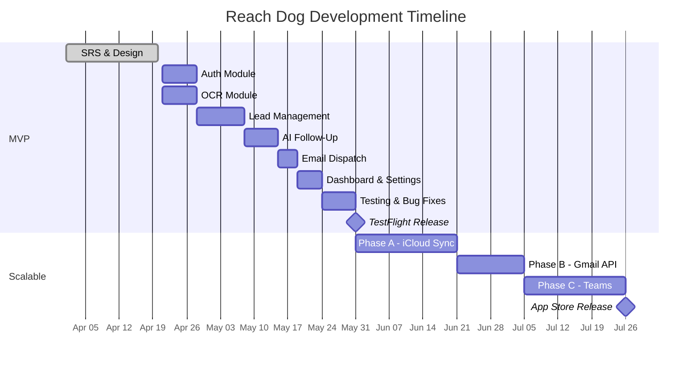

## 4.10 Risk Management

| Risk | Likelihood | Impact | Mitigation |
|---|---|---|---|
| Gemini API deprecation/pricing change | Medium | High | Abstract AI service behind protocol; swap to on-device LLM |
| OCR accuracy on poor-quality cards | High | Medium | Allow manual field editing; iterative parser improvements |
| App Store rejection | Low | High | Follow HIG strictly; no private APIs |
| API key compromise | Low | Critical | Keychain storage; key rotation; rate limiting |
| Device theft exposing lead data | Medium | High | AES-256 at-rest encryption via Data Protection |
| CloudKit sync conflicts (Scalable) | Medium | Medium | Last-writer-wins with conflict UI |

\newpage

# 5. Methodology

## 5.1 Waterfall Methodology

This project follows a modified Waterfall approach: Requirements → Design → Implementation → Testing → Deployment. Each phase completes before the next begins, which suits a well-defined MVP with fixed scope. The scalable release follows the same phases incrementally (Phase A, B, C).

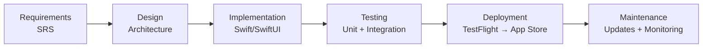

\newpage

# 6. Analysis

## 6.1 Functional Requirements

Requirements marked **(MVP)** are prototype scope. **(Scalable)** are production evolution. *Shall* = binding.

### 6.1.1 Authentication and Identity

| ID | Tier | Requirement |
|---|---|---|
| FR-1.1 | MVP | The system shall offer Sign in with Apple via `AuthenticationServices`. |
| FR-1.2 | MVP | The system shall offer Google Sign-In via `GoogleSignIn-iOS` SDK. |
| FR-1.3 | MVP | The system shall persist a minimal user profile locally (provider ID, email, display name, provider label). |
| FR-1.4 | MVP | The system shall provide a logout control that clears the session while retaining local data. |
| FR-1.5 | Scalable | The system shall support team invitation via shareable deep link. |
| FR-1.6 | Scalable | The system shall enforce role-based access control (Sales Agent, Sales Manager, Team Administrator). |

### 6.1.2 Lead Capture via OCR

| ID | Tier | Requirement |
|---|---|---|
| FR-2.1 | MVP | The system shall present a Scan screen with live camera capture and photo-gallery import. |
| FR-2.2 | MVP | The system shall invoke `VNRecognizeTextRequest` in fast mode on acquired images. |
| FR-2.3 | MVP | The system shall parse recognised text into Full Name, Company, Job Title, Email, Phone, and Website fields. |
| FR-2.4 | MVP | The system shall present a Review Contact screen with the card image and editable extracted fields. |
| FR-2.5 | MVP | The system shall permit free-form tag attachment during review. |
| FR-2.6 | Scalable | The system shall permit batch capture (up to 10 cards before review). |
| FR-2.7 | Scalable | The system shall deduplicate against existing records via enterprise contact SDKs. |

### 6.1.3 Lead Management

| ID | Tier | Requirement |
|---|---|---|
| FR-3.1 | MVP | The system shall persist leads in the local SwiftData store. |
| FR-3.2 | MVP | The system shall render leads as a scrollable card-based list. |
| FR-3.3 | MVP | The system shall provide case-insensitive substring search over name, company, and email. |
| FR-3.4 | MVP | The system shall open a Lead Profile view on card selection. |
| FR-3.5 | MVP | The Lead Profile shall support status editing among `new`, `follow-up`, and `contacted`. |
| FR-3.6 | MVP | The system shall permit lead deletion with confirmation. |
| FR-3.7 | Scalable | The system shall support user-defined pipeline stages. |
| FR-3.8 | Scalable | The system shall present a Kanban view grouped by pipeline stage. |

### 6.1.4 AI Follow-Up Generation

| ID | Tier | Requirement |
|---|---|---|
| FR-4.1 | MVP | The Lead Profile shall expose a Generate Follow-Up control. |
| FR-4.2 | MVP | The system shall compose a prompt (name, company, title, notes) and dispatch to Gemini Flash API. |
| FR-4.3 | MVP | The system shall present one or more draft variations with subject and body. |
| FR-4.4 | MVP | The system shall offer a library of static templates parameterised with lead fields. |
| FR-4.5 | MVP | The system shall instruct the AI to limit bodies to ~300 words. |
| FR-4.6 | Scalable | The system shall support user-authored prompt templates. |
| FR-4.7 | Scalable | The system shall cache the most recent generation per lead for offline review. |

### 6.1.5 Email Dispatch

| ID | Tier | Requirement |
|---|---|---|
| FR-5.1 | MVP | The system shall provide a Copy control (system pasteboard). |
| FR-5.2 | MVP | The system shall construct an email URL with pre-filled `to`, `subject`, `body`. |
| FR-5.3 | MVP | Gmail: `googlegmail://co?` scheme. |
| FR-5.4 | MVP | Apple Mail: `mailto:` scheme (default). |
| FR-5.5 | MVP | Mark Sent → status updated to `contacted`. |
| FR-5.6 | Scalable | Native in-app Gmail API send (OAuth scope: `gmail.send`). |
| FR-5.7 | Scalable | Native in-app Apple Mail via `MFMailComposeViewController`. |
| FR-5.8 | Scalable | Delivery confirmation tracking where available. |

### 6.1.6 Settings and Data Portability

| ID | Tier | Requirement |
|---|---|---|
| FR-6.1 | MVP | Settings: preferred mail client selector (Gmail / Apple Mail) + logout. |
| FR-6.2 | MVP | CSV export via iOS share sheet. |
| FR-6.3 | MVP | CSV import, appending to existing store. |
| FR-6.4 | Scalable | iCloud sync via CloudKit private database. |
| FR-6.5 | Scalable | Scheduled local reminders for `follow-up` leads. |

### 6.1.7 Analytics Dashboard

| ID | Tier | Requirement |
|---|---|---|
| FR-7.1 | MVP | Home dashboard: lead counts per status + Swift Charts visualisation. |
| FR-7.2 | Scalable | Time-series: leads/week, conversion rate. |
| FR-7.3 | Scalable | Sales Manager aggregated team dashboard. |

### 6.1.8 Team Collaboration (Scalable)

| ID | Tier | Requirement |
|---|---|---|
| FR-8.1 | Scalable | Team creation → creator becomes Team Administrator. |
| FR-8.2 | Scalable | Invite members via time-limited link. |
| FR-8.3 | Scalable | Shared template library (Team Admin editable). |
| FR-8.4 | Scalable | Lead ownership transfer between team members. |

## 6.2 Non-Functional Requirements

### 6.2.1 Performance

| ID | Tier | Requirement | Target |
|---|---|---|---|
| NFR-P1 | MVP | OCR extraction latency | ≤ 2 s per card |
| NFR-P2 | MVP | Peak resident memory | ≤ 400 MB |
| NFR-P3 | MVP | Sustained CPU utilisation | ≤ 30% |
| NFR-P4 | MVP | Local storage footprint | ≤ 500 MB |
| NFR-P5 | MVP | Binary size | ≤ 300 MB |
| NFR-P6 | MVP | AI round-trip latency | ≤ 5 s on 4G |
| NFR-P7 | Scalable | CloudKit sync convergence | ≤ 15 s |
| NFR-P8 | Scalable | Concurrent team users | 50 |

### 6.2.2 Security

| ID | Requirement |
|---|---|
| NFR-S1 | AES-256 at-rest encryption via `FileProtectionType.complete` |
| NFR-S2 | Gemini API key stored in Keychain (`kSecAttrAccessibleWhenUnlockedThisDeviceOnly`) |
| NFR-S3 | All network traffic over TLS 1.2+ with ATS enabled |
| NFR-S4 | Identity tokens validated within Apple/Google SDKs only |
| NFR-S5 | No PII logged in production builds |
| NFR-S6 | CloudKit private containers per user (Scalable) |

### 6.2.3 Privacy

- Only name, company, title, notes sent to Gemini API — minimum necessary for draft generation
- Business-card images never transmitted externally
- GDPR Article 5 compliant: data minimisation, purpose limitation, user control
- No lead data stored on company infrastructure (MVP)

### 6.2.4 Usability

| ID | Requirement |
|---|---|
| NFR-U1 | Conforms to Apple HIG |
| NFR-U2 | Dynamic Type across all primary text |
| NFR-U3 | Passes Xcode Accessibility Audit |
| NFR-U4 | Scan → email sent in ≤ 6 taps |

### 6.2.5 Reliability

- MTBF > 500 hours active use
- Graceful degradation: static templates when Gemini is unreachable

### 6.2.6 Maintainability

- MVVM pattern throughout
- > 70% unit-test coverage for domain services
- Swift concurrency (`async`/`await`) for all async operations

\newpage

# 7. Process and Data Modelling

## 7.1 Context Diagram (MVP)

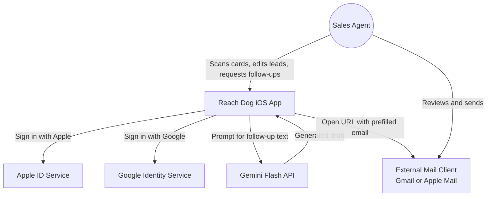

## 7.2 Context Diagram (Scalable)

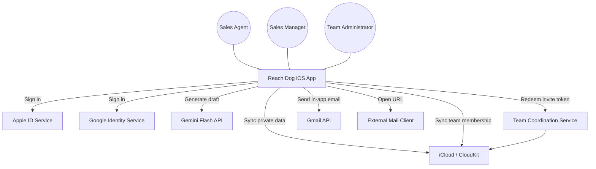

## 7.3 DFD Level 0

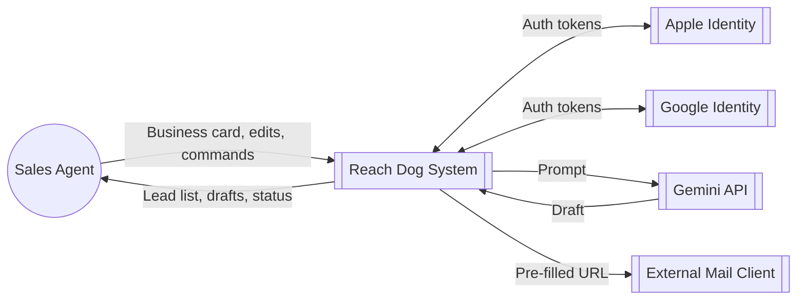

## 7.4 DFD Level 1 (MVP)

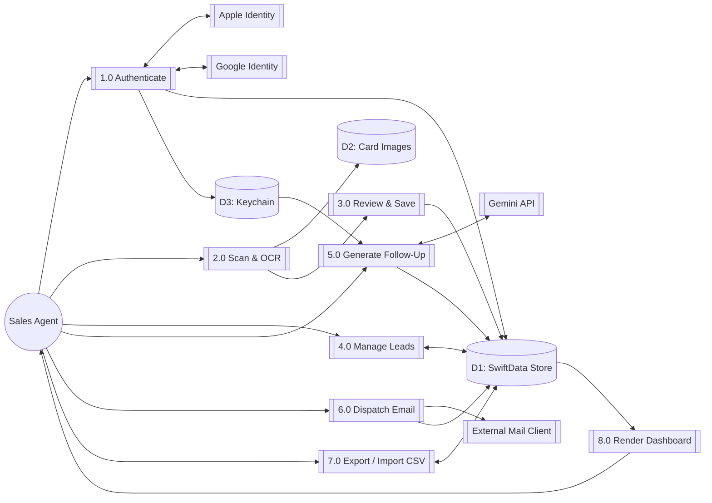

## 7.5 Entity-Relationship Diagram (MVP)

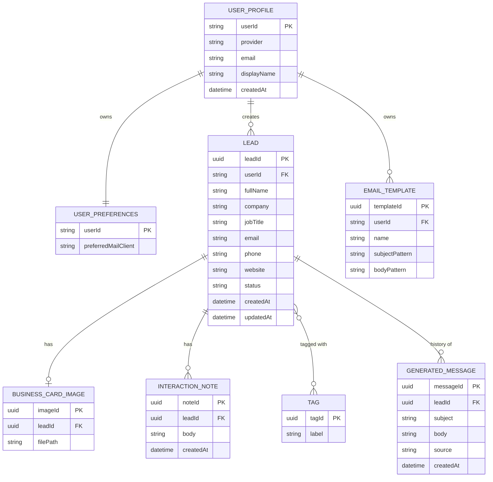

## 7.6 Entity-Relationship Diagram (Scalable Extensions)

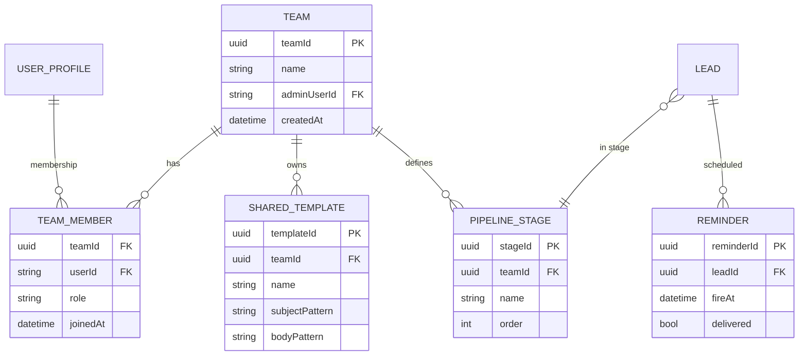

## 7.7 Database Schema (SwiftData)

**UserProfile**

| Field | Type | Nullable | Notes |
|---|---|---|---|
| userId | String (PK) | No | Provider-assigned |
| provider | String | No | `apple` / `google` |
| email | String | No | |
| displayName | String | Yes | |
| createdAt | Date | No | |

**UserPreferences**

| Field | Type | Nullable | Notes |
|---|---|---|---|
| userId | String (PK, FK) | No | 1:1 with UserProfile |
| preferredMailClient | String | No | `gmail` / `appleMail` |
| reminderDefaultInDays | Int | Yes | Scalable only |

**Lead**

| Field | Type | Nullable | Notes |
|---|---|---|---|
| leadId | UUID (PK) | No | |
| userId | String (FK) | No | |
| fullName | String | No | |
| company | String | Yes | |
| jobTitle | String | Yes | |
| email | String | Yes | |
| phone | String | Yes | |
| website | String | Yes | |
| status | String | No | Enum: `new`, `follow-up`, `contacted` |
| stageId | UUID (FK) | Yes | Scalable only |
| createdAt | Date | No | |
| updatedAt | Date | No | |

**BusinessCardImage**

| Field | Type | Nullable | Notes |
|---|---|---|---|
| imageId | UUID (PK) | No | |
| leadId | UUID (FK) | No | |
| filePath | String | No | Sandbox-relative path |

**InteractionNote**

| Field | Type | Nullable | Notes |
|---|---|---|---|
| noteId | UUID (PK) | No | |
| leadId | UUID (FK) | No | |
| body | String | No | |
| createdAt | Date | No | |

**Tag** *(many-to-many via implicit join set)*

| Field | Type | Nullable | Notes |
|---|---|---|---|
| tagId | UUID (PK) | No | |
| label | String | No | |

**GeneratedMessage**

| Field | Type | Nullable | Notes |
|---|---|---|---|
| messageId | UUID (PK) | No | |
| leadId | UUID (FK) | No | |
| subject | String | No | |
| body | String | No | |
| source | String | No | `ai` / `template` |
| createdAt | Date | No | |

**EmailTemplate**

| Field | Type | Nullable | Notes |
|---|---|---|---|
| templateId | UUID (PK) | No | |
| userId | String (FK) | No | |
| name | String | No | |
| subjectPattern | String | No | Tokens: `{fullName}`, `{company}`, etc. |
| bodyPattern | String | No | |

\newpage

# 8. System Design

## 8.1 Architectural Overview (MVP)

Three-layer client-only architecture on iOS:

1. **Presentation Layer** — SwiftUI views + MVVM ViewModels
2. **Domain Layer** — Stateless services: `AuthService`, `OCRService`, `LeadService`, `AIService`, `EmailDispatcher`, `CSVService`
3. **Persistence Layer** — SwiftData (structured data), File System (card images), Keychain (API key, tokens)

No backend. External dependencies limited to three HTTPS services: Apple Identity, Google Identity, Gemini Flash API.

**Key properties:** Zero operational cost, strong privacy by construction (data never leaves device except Gemini prompt), fully functional offline (except AI generation).

## 8.2 Architectural Overview (Scalable)

Preserves local-first. Adds:
- **CloudKit** — per-user private sync across devices (user's own iCloud, not company infra)
- **Serverless coordination service** (AWS Lambda / Cloudflare Workers) — team invitation tokens and membership arbitration only. No lead data passes through it.

## 8.2.1 Key Design Rationales

Several design choices in this specification trade off richness for simplicity, and are documented here so reviewers can evaluate them explicitly.

**Company stored as plain text on `Lead`, not as a separate entity.** A Company entity with autocomplete reuse across leads would enrich the CRM, but it introduces non-trivial UX complexity (fuzzy matching, de-duplication, merge flows). The MVP's scanning workflow already fills the Company field directly from the business card via OCR; if OCR fails, the user types it freely. Promoting Company to an entity is deferred to a scalable-release enhancement and is **out of MVP scope**.

**"Event" concept dropped in favour of free-form tags.** An earlier design iteration considered a separate `Event` entity to track which conference or meeting a lead was captured at. On review of the captured-UI screens, no Event field surfaced to the user; tags (e.g. `#techconf-2026`) cover the same informational need with zero schema cost. Event is therefore **explicitly excluded from both MVP and scalable releases**, and tags are the canonical mechanism for grouping leads by origin.

**CSV export/import is the MVP's cross-device migration strategy.** Since MVP data is local-only (no CloudKit in MVP, no backend), users switching devices export their data as CSV and re-import on the new device. This is not a limitation to apologise for; it is a deliberate **privacy-preserving ownership** choice consistent with the "local-first" principle. Cross-device automatic sync is introduced in Scalable Phase A via CloudKit private containers (FR-6.4).

**AI-generated email bodies are capped at ~300 words (FR-4.5) to stay within URL-scheme length tolerances (FR-5.2).** The MVP dispatches email by building a `mailto:` or `googlegmail://` URL with pre-filled subject and body. Observed truncation thresholds on iOS are approximately 2000–4000 characters, and a 300-word email is roughly 1500–2000 characters — comfortably inside the safe margin. FR-4.5 is therefore not an arbitrary quality constraint; it is a **technical prerequisite for FR-5.2 to operate reliably**.

**Auto-fill both subject and body (vs. copy-then-paste).** An earlier design considered having the user copy the body to the clipboard and paste it into an empty compose window. The final design auto-fills both fields, reducing the flow to a single tap, at the cost of being sensitive to URL length (mitigated by FR-4.5 above). The Copy button is retained as a secondary action for users who wish to paste the draft into a non-email destination such as LinkedIn messaging or WhatsApp.

## 8.3 Component Diagram (MVP)

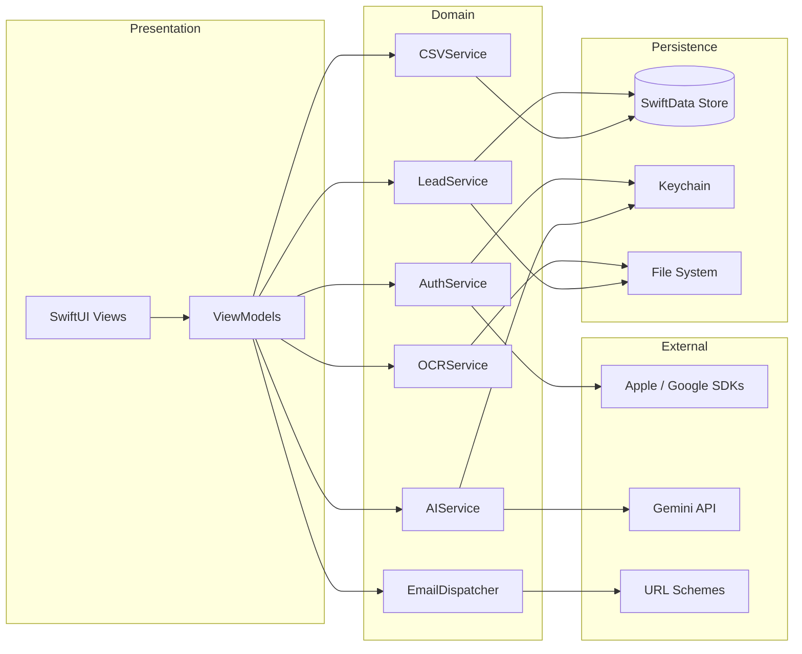

## 8.4 Component Diagram (Scalable)

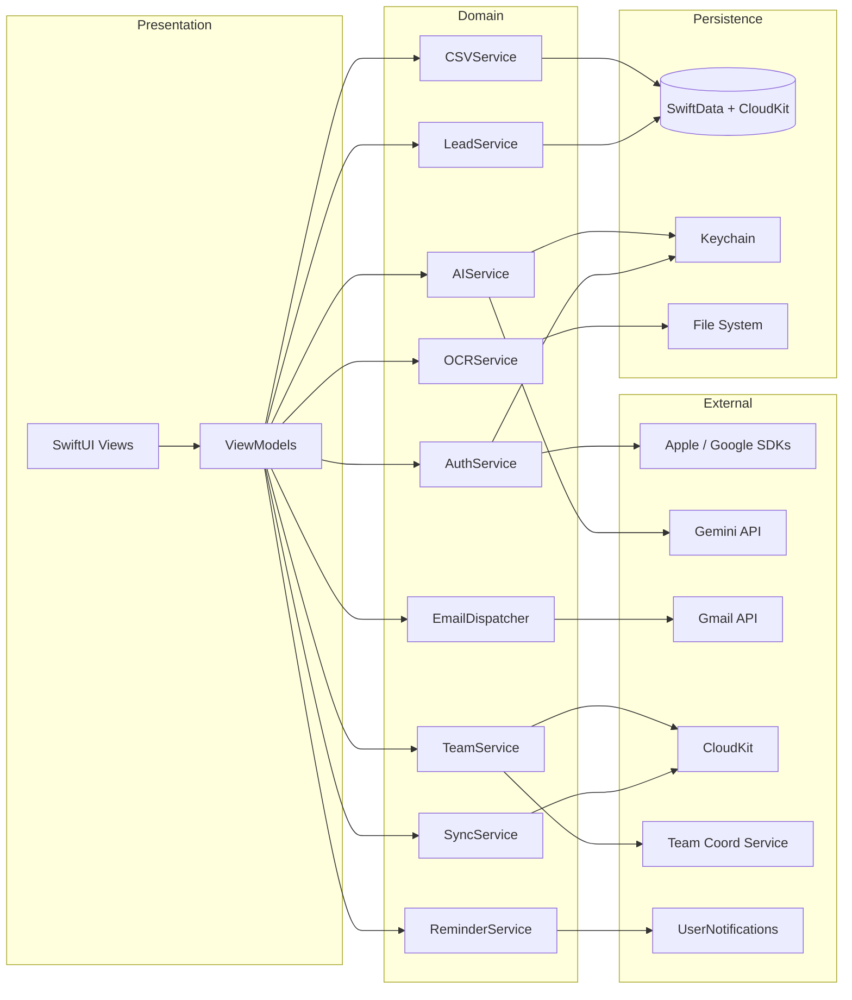

## 8.5 Deployment Diagram (MVP)

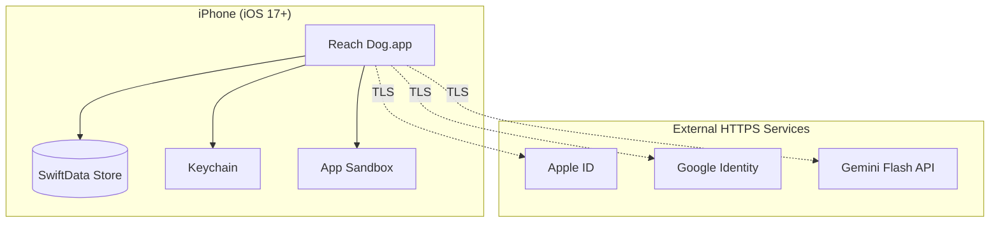

## 8.6 Deployment Diagram (Scalable)

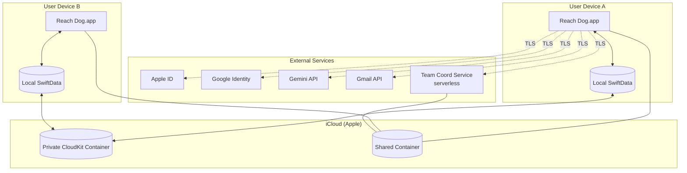

## 8.7 External Service Interfaces

### 8.7.1 Gemini Flash API

**Endpoint:** `POST https://generativelanguage.googleapis.com/v1/models/gemini-flash:generateContent?key={API_KEY}`

**Request:**

```json
{
  "contents": [{
    "parts": [{
      "text": "Draft a concise professional follow-up email to {fullName} ({jobTitle} at {company}). Interaction notes: {notes}. Limit to 300 words."
    }]
  }],
  "generationConfig": { "maxOutputTokens": 512, "temperature": 0.7 }
}
```

**Response:**

```json
{
  "candidates": [{
    "content": { "parts": [{ "text": "Subject: ...\n\nHi {fullName},\n..." }] }
  }]
}
```

### 8.7.2 Gmail API (Scalable)

**Endpoint:** `POST https://gmail.googleapis.com/gmail/v1/users/me/messages/send`
**Auth:** OAuth 2.0 bearer token, scope `https://www.googleapis.com/auth/gmail.send`
**Body:** base64url-encoded RFC 2822 message

### 8.7.3 URL Schemes (MVP)

| Scheme | Client | Format |
|---|---|---|
| `mailto:` | Apple Mail | `mailto:{to}?subject={s}&body={b}` |
| `googlegmail://` | Gmail | `googlegmail://co?to={to}&subject={s}&body={b}` |

## 8.8 Internal Service Operations

| Service | Operation | Purpose |
|---|---|---|
| AuthService | `signInWithApple()` | Initiate Apple auth flow |
| AuthService | `signInWithGoogle()` | Initiate Google auth flow |
| AuthService | `signOut()` | Terminate session |
| OCRService | `recognise(image: UIImage) -> OCRResult` | Extract text from card |
| LeadService | `create(lead: LeadDraft) -> Lead` | Persist new lead |
| LeadService | `list(filter: LeadFilter) -> [Lead]` | Retrieve leads |
| LeadService | `update(lead: Lead) -> Lead` | Persist edits |
| LeadService | `delete(leadId: UUID)` | Remove lead |
| AIService | `generateFollowUp(lead: Lead, notes: String) -> [Message]` | Query Gemini |
| EmailDispatcher | `dispatch(message: Message, to: Lead)` | Open external client |
| CSVService | `exportAll() -> URL` | Produce CSV file |
| CSVService | `import(from: URL) -> ImportReport` | Ingest CSV file |

Scalable additions:

| Service | Operation | Purpose |
|---|---|---|
| SyncService | `pullChanges()` / `pushChanges()` | CloudKit sync |
| TeamService | `createTeam(name:)` | Bootstrap a team |
| TeamService | `generateInvite(teamId:)` | Mint invitation token |
| TeamService | `redeemInvite(token:)` | Join a team |
| ReminderService | `schedule(lead: Lead, at: Date)` | Register local notification |

## 8.9 UI Design — Key Screens (MVP)

### Screen Map

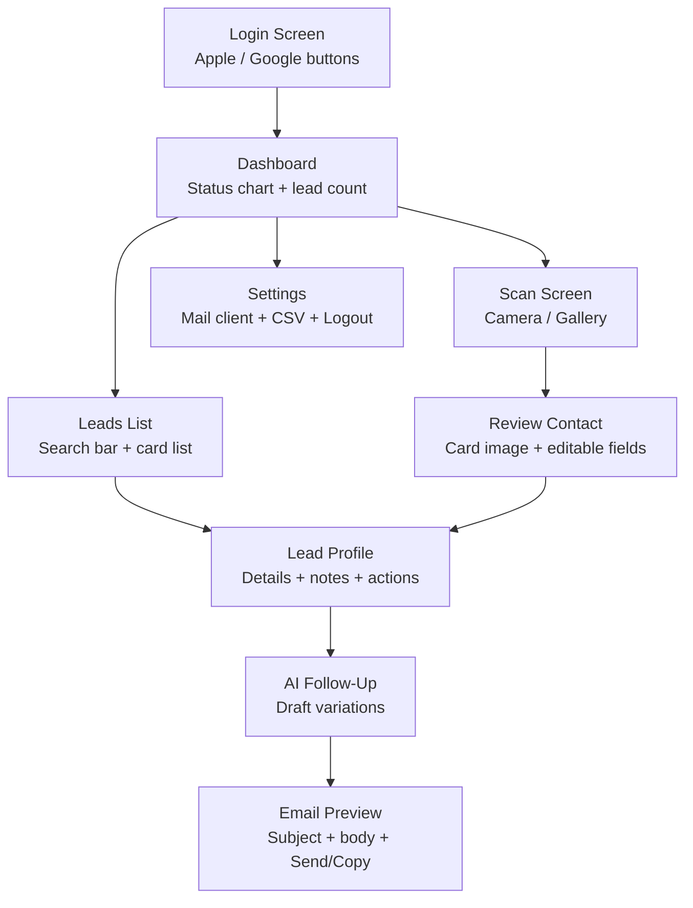

### Screen Descriptions

| Screen | Layout | Key Elements |
|---|---|---|
| **Login** | Centred logo + 2 buttons | Apple Sign-In button (system style), Google Sign-In button |
| **Dashboard** | Top: status chart (Swift Charts pie/bar), Bottom: recent leads | Lead count badges (New / Follow-Up / Contacted) |
| **Leads List** | Top: search bar, Body: scrollable card list | Each card: name, company, status badge, avatar placeholder |
| **Scan** | Full-screen camera viewfinder | Shutter button, gallery icon, flash toggle |
| **Review Contact** | Top: card image thumbnail, Body: form fields | Fields: Name, Company, Title, Email, Phone, Website, Tags |
| **Lead Profile** | Header: name + company, Body: details + notes list | Action buttons: Generate Follow-Up, Edit, Delete |
| **AI Follow-Up** | Segmented: AI / Templates tab | Draft cards with subject + body preview, Select button |
| **Email Preview** | Subject field, body text area | Buttons: Send via Gmail, Send via Mail, Copy, Cancel |
| **Settings** | Grouped list | Mail client picker, Export CSV, Import CSV, Logout |

\newpage

# 9. UML Diagrams

## 9.1 Use Case Diagram (MVP)

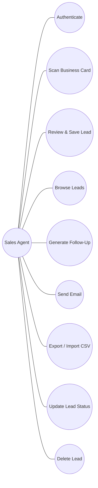

## 9.2 Use Case Diagram (Scalable)

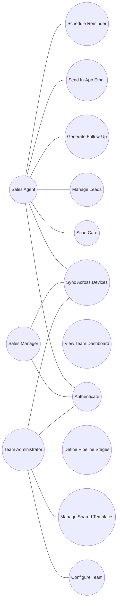

## 9.3 Activity Diagram — Primary Flow (MVP)

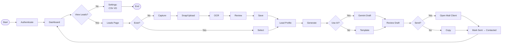

## 9.3.1 Flowchart — Detailed Decision Tree (MVP)

The flowchart complements the activity diagram by exposing every boolean decision point in the user flow. Each diamond corresponds to an `if` statement in the application logic.

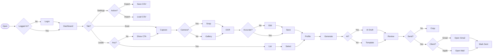

## 9.4 Sequence Diagram — Scan and Save

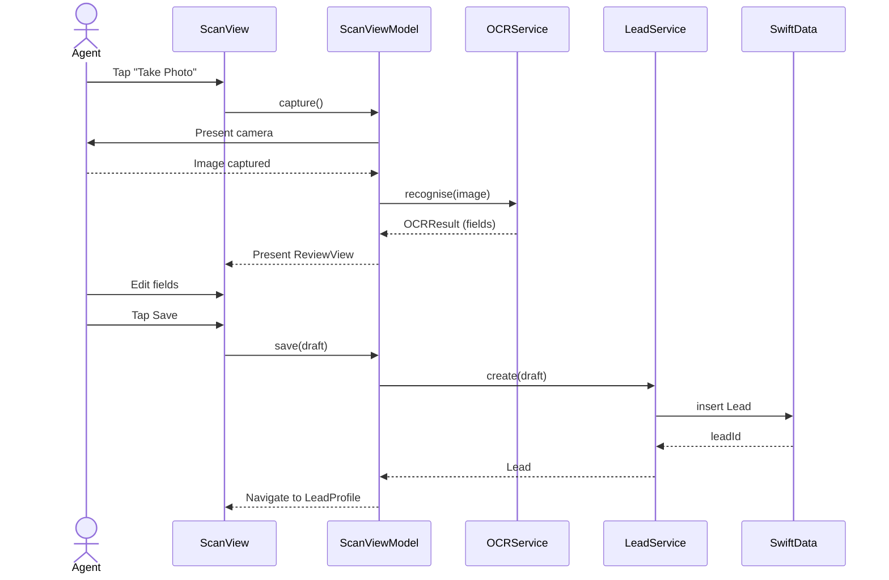

## 9.5 Sequence Diagram — Generate AI Follow-Up

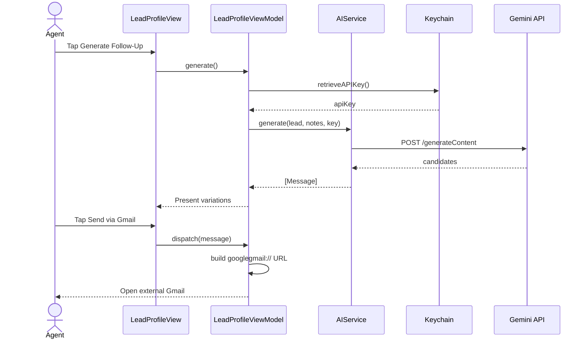

## 9.6 Sequence Diagram — CloudKit Sync (Scalable)

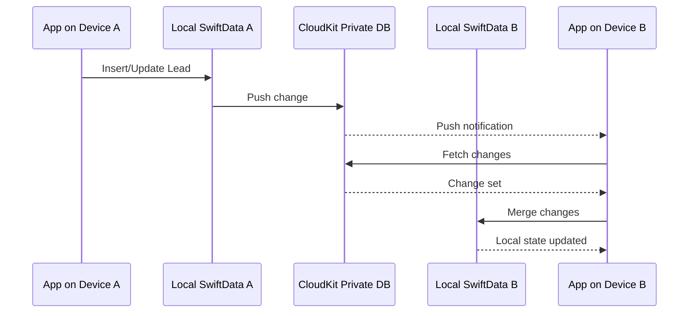

## 9.7 Class Diagram — Domain Model (MVP)

```mermaid
classDiagram
    class UserProfile {
        +String userId
        +String provider
        +String email
        +String? displayName
        +Date createdAt
    }
    class UserPreferences {
        +String userId
        +String preferredMailClient
    }
    class Lead {
        +UUID leadId
        +String userId
        +String fullName
        +String? company
        +String? jobTitle
        +String? email
        +String? phone
        +String? website
        +Status status
        +Date createdAt
        +Date updatedAt
    }
    class BusinessCardImage {
        +UUID imageId
        +UUID leadId
        +String filePath
    }
    class InteractionNote {
        +UUID noteId
        +UUID leadId
        +String body
        +Date createdAt
    }
    class Tag {
        +UUID tagId
        +String label
    }
    class GeneratedMessage {
        +UUID messageId
        +UUID leadId
        +String subject
        +String body
        +Source source
        +Date createdAt
    }
    class EmailTemplate {
        +UUID templateId
        +String userId
        +String name
        +String subjectPattern
        +String bodyPattern
    }

    UserProfile "1" -- "1" UserPreferences
    UserProfile "1" -- "*" Lead
    UserProfile "1" -- "*" EmailTemplate
    Lead "1" -- "0..1" BusinessCardImage
    Lead "1" -- "*" InteractionNote
    Lead "*" -- "*" Tag
    Lead "1" -- "*" GeneratedMessage
```

## 9.8 State Machine Diagram — Lead Lifecycle

```mermaid
stateDiagram-v2
    [*] --> New : create
    New --> FollowUp : user sets reminder
    New --> Contacted : Mark Sent
    FollowUp --> Contacted : Mark Sent
    Contacted --> [*]
    FollowUp --> New : revert
    Contacted --> FollowUp : re-open
```

## 9.9 Package Diagram

```mermaid
flowchart LR
    subgraph App["ReachDog.app"]
        direction TB
        subgraph Pres["📦 Presentation"]
            Views[Views + ViewModels]
        end
        subgraph Dom["📦 Domain"]
            Svcs[AuthService · OCRService<br/>LeadService · AIService<br/>EmailDispatcher · CSVService]
        end
        subgraph Data["📦 Data"]
            Models[SwiftData Models<br/>+ Repositories]
        end
        subgraph Infra["📦 Infrastructure"]
            Low[NetworkClient · KeychainManager<br/>FileStorageManager]
        end
    end
    subgraph Ext["📦 External"]
        SDKs[Apple AuthenticationServices<br/>GoogleSignIn-iOS · Vision · Swift Charts]
    end

    Pres --> Dom
    Dom --> Data
    Dom --> Infra
    Infra --> Ext
```

## 9.10 Object Diagram — Runtime Snapshot

```mermaid
flowchart TB
    subgraph Runtime["Runtime Object Snapshot"]
        u1["user1: UserProfile<br/>userId = 'apple_001'<br/>provider = 'apple'<br/>email = 'john@acme.com'<br/>displayName = 'John Doe'"]
        
        p1["prefs1: UserPreferences<br/>userId = 'apple_001'<br/>preferredMailClient = 'gmail'"]
        
        l1["lead1: Lead<br/>leadId = UUID-A<br/>fullName = 'Sarah Chen'<br/>company = 'TechCorp'<br/>jobTitle = 'VP Engineering'<br/>status = 'new'"]
        
        l2["lead2: Lead<br/>leadId = UUID-B<br/>fullName = 'Mike Ross'<br/>company = 'LegalTech'<br/>jobTitle = 'CTO'<br/>status = 'contacted'"]
        
        img1["img1: BusinessCardImage<br/>imageId = UUID-C<br/>filePath = '/cards/uuid-a.jpg'"]
        
        note1["note1: InteractionNote<br/>body = 'Met at CES booth #42'"]
        
        msg1["msg1: GeneratedMessage<br/>subject = 'Great meeting you at CES'<br/>source = 'ai'"]
        
        tag1["tag1: Tag<br/>label = 'CES-2026'"]
    end

    u1 --- p1
    u1 --> l1
    u1 --> l2
    l1 --- img1
    l1 --- note1
    l1 --- msg1
    l1 --- tag1
    l2 --- tag1
```

## 9.11 Communication Diagram — Generate Follow-Up

```mermaid
flowchart LR
    Agent((Agent))
    View[LeadProfileView]
    VM[LeadProfileVM]
    KC[Keychain]
    AI[AIService]
    Gem[Gemini API]

    Agent -->|"1: tap Generate"| View
    View -->|"2: generate()"| VM
    VM -->|"3: retrieveAPIKey()"| KC
    KC -->|"4: return apiKey"| VM
    VM -->|"5: generate(lead, notes, key)"| AI
    AI -->|"6: POST /generateContent"| Gem
    Gem -->|"7: return candidates"| AI
    AI -->|"8: return [Message]"| VM
    VM -->|"9: update UI"| View
    View -->|"10: display drafts"| Agent
```

## 9.12 Interaction Overview Diagram — Main App Flow

```mermaid
flowchart TD
    start([Start])
    start --> d1{Authenticated?}
    
    d1 -->|No| auth_seq["ref: Authentication Sequence<br/>(Apple or Google Sign-In)"]
    d1 -->|Yes| dash[Dashboard]
    auth_seq --> dash
    
    dash --> d2{User Action?}
    
    d2 -->|Scan| scan_seq["ref: Scan & Save Sequence<br/>(Camera → OCR → Review → Save)"]
    d2 -->|Browse| leads[Lead List → Select → Profile]
    d2 -->|Settings| settings[Settings Screen]
    
    scan_seq --> profile[Lead Profile]
    leads --> profile
    
    profile --> d3{Generate Follow-Up?}
    d3 -->|Yes| ai_seq["ref: AI Follow-Up Sequence<br/>(Gemini API → Draft → Review)"]
    d3 -->|No| dash
    
    ai_seq --> d4{Send?}
    d4 -->|Yes| dispatch["ref: Email Dispatch<br/>(URL Scheme → External Client)"]
    d4 -->|Copy| copy[Copy to Clipboard]
    
    dispatch --> mark[Mark Contacted]
    copy --> dash
    mark --> dash
    
    settings --> d5{Action?}
    d5 -->|Export| csv_export[Generate CSV → Share Sheet]
    d5 -->|Import| csv_import[Select CSV → Append Leads]
    d5 -->|Logout| start
    csv_export --> dash
    csv_import --> dash
```

## 9.13 Timing Diagram — Scan-to-Email Flow

```mermaid
gantt
    title Timing: Scan Card → Send Email (Target < 60 seconds)
    dateFormat ss
    axisFormat %S s

    section User
    Tap Scan              :u1, 00, 1s
    Snap Photo            :u2, after u1, 2s
    Review Fields         :u4, after s1, 5s
    Tap Save              :u5, after u4, 1s
    Tap Generate          :u6, after u5, 1s
    Review Draft          :u8, after a1, 5s
    Tap Send              :u9, after u8, 1s

    section System
    OCR Processing        :s1, after u2, 2s
    Save to SwiftData     :s2, after u5, 1s
    Open Mail Client      :s3, after u9, 1s

    section Network
    Gemini API Call        :a1, after u6, 4s
```

> **Total estimated time: ~23 seconds** — well within the 60-second target.

\newpage

# 10. MVP Design

## 10.1 MVP Definition

The MVP is a fully functional iOS application that delivers the core value proposition: **scan a business card and have a personalised follow-up email ready to send within 60 seconds**. It runs entirely on-device with no company-operated backend.

## 10.2 MVP vs Full System Comparison

| Capability | MVP | Scalable |
|---|---|---|
| Apple / Google Sign-In | ✓ | ✓ |
| Team invitations | — | ✓ |
| On-device OCR | ✓ | ✓ |
| Batch card capture | — | ✓ |
| Local SwiftData | ✓ | ✓ |
| iCloud synchronisation | — | ✓ |
| AI follow-up (Gemini) | ✓ | ✓ |
| Custom AI prompt templates | — | ✓ |
| Static template library | ✓ (personal) | ✓ (personal + team) |
| Email via URL scheme | ✓ | ✓ (fallback) |
| In-app Gmail API send | — | ✓ |
| Fixed status triad | ✓ | — |
| Custom pipeline stages | — | ✓ |
| Free-text tags | ✓ | ✓ |
| CSV export / import | ✓ | ✓ |
| Local reminders | — | ✓ |
| Personal dashboard | ✓ | ✓ |
| Team dashboard | — | ✓ |

## 10.3 MVP Architecture (Simplified)

```mermaid
flowchart LR
    subgraph iPhone
        UI[SwiftUI + ViewModels] --> Services[Domain Services]
        Services --> Store[(SwiftData + Keychain + Files)]
    end
    Services -. "TLS" .-> Ext[Apple ID / Google ID / Gemini API]
    UI -. "URL Scheme" .-> Mail[Gmail / Apple Mail]
```

## 10.4 Evolution Plan: MVP → Scalable

| Phase | Scope | Effort |
|---|---|---|
| **Phase A** | iCloud sync — annotate SwiftData for CloudKit, add `SyncService`, migrate local data | Moderate |
| **Phase B** | In-app email — Gmail API OAuth, `MFMailComposeViewController`, keep URL scheme as fallback | Moderate |
| **Phase C** | Team workspaces — `TeamService`, `SharedTemplate`, `PipelineStage`, CloudKit shared DB, serverless coord | Substantial |

\newpage

# 11. Testing

## 11.1 Testing Strategy

| Level | Scope | Tools |
|---|---|---|
| **Unit Testing** | Domain services (AuthService, OCRService, LeadService, AIService, CSVService) | XCTest, mocked dependencies |
| **Integration Testing** | ViewModel ↔ Service ↔ SwiftData | XCTest with in-memory SwiftData |
| **UI Testing** | Full user flows | XCUITest |
| **Performance Testing** | OCR latency, memory, CPU | Xcode Instruments |
| **Security Testing** | Keychain usage, TLS, ATS | Static analysis, SwiftLint, manual review |
| **Compatibility Testing** | Device matrix | iPhone SE 3, 13, 15 Pro, 16 Pro Max × iOS 17.0, 17.5, 18.0 |

## 11.2 Test Cases

| TC-ID | Feature | Test Case | Input | Expected Result | Priority |
|---|---|---|---|---|---|
| TC-01 | Auth | Apple Sign-In success | Valid Apple ID | User profile created, navigate to dashboard | High |
| TC-02 | Auth | Google Sign-In success | Valid Google account | User profile created, navigate to dashboard | High |
| TC-03 | Auth | Sign-In cancelled | User cancels auth | Remain on login screen, no error | Medium |
| TC-04 | Auth | Logout | Tap logout | Session cleared, return to login, data retained | High |
| TC-05 | OCR | Scan clear card | Well-lit business card photo | All 6 fields extracted correctly | High |
| TC-06 | OCR | Scan blurry card | Poor quality image | Partial fields extracted, manual edit available | High |
| TC-07 | OCR | Gallery import | Select image from gallery | OCR processes, review screen shown | Medium |
| TC-08 | OCR | Performance | Standard card image | ≤ 2 seconds extraction time | High |
| TC-09 | Lead | Create lead | Save from review screen | Lead persisted in SwiftData, appears in list | High |
| TC-10 | Lead | Edit lead | Modify fields on profile | Changes persisted, updatedAt updated | Medium |
| TC-11 | Lead | Delete lead | Confirm deletion | Lead removed from store and list | High |
| TC-12 | Lead | Search leads | Type partial name | Matching leads shown, case-insensitive | Medium |
| TC-13 | Lead | Status update | Change to "contacted" | Status badge updated, dashboard reflects change | High |
| TC-14 | AI | Generate follow-up | Lead with all fields + notes | 1+ draft variations returned with subject + body | High |
| TC-15 | AI | Gemini unreachable | Network off | Error message shown, static templates offered | High |
| TC-16 | AI | Response latency | Standard prompt | ≤ 5 seconds on 4G | Medium |
| TC-17 | Email | Send via Gmail | Tap Send, Gmail installed | Gmail opens with pre-filled to/subject/body | High |
| TC-18 | Email | Send via Apple Mail | Tap Send, default client | Mail.app opens with pre-filled fields | High |
| TC-19 | Email | Copy to clipboard | Tap Copy | Message body on pasteboard, success feedback | Medium |
| TC-20 | Email | Mark Sent | Tap Mark Sent | Lead status → "contacted" | High |
| TC-21 | CSV | Export | Tap Export CSV | CSV file generated, share sheet opens | Medium |
| TC-22 | CSV | Import valid | Select valid CSV | Leads appended, count matches | Medium |
| TC-23 | CSV | Import malformed | Select broken CSV | Error shown, no data corrupted | Medium |
| TC-24 | Dashboard | Lead counts | 3 new, 2 follow-up, 1 contacted | Chart shows correct distribution | Medium |
| TC-25 | Security | API key storage | Inspect Keychain | Key stored with correct protection class | High |
| TC-26 | Security | Network traffic | Proxy inspection | All calls over TLS 1.2+, no plaintext | High |
| TC-27 | Perf | Memory usage | Scan 20 cards sequentially | Peak memory ≤ 400 MB | Medium |
| TC-28 | A11y | Accessibility audit | Run Xcode audit | Zero critical violations | Medium |

## 11.3 Requirements Traceability Matrix

Every MVP functional requirement maps to at least one test case, ensuring verifiable coverage. The matrix also enables impact analysis: when a requirement changes, the affected test cases are immediately identifiable.

| FR ID | Requirement Summary | Test Case(s) | Priority |
|---|---|---|---|
| FR-1.1 | Sign in with Apple | TC-01 | High |
| FR-1.2 | Sign in with Google | TC-02 | High |
| FR-1.3 | Persist user profile locally | TC-01, TC-02 | High |
| FR-1.4 | Logout control | TC-04 | High |
| FR-2.1 | Scan screen (camera + gallery) | TC-05, TC-07 | High |
| FR-2.2 | Invoke VNRecognizeTextRequest | TC-05, TC-06, TC-08 | High |
| FR-2.3 | Parse recognised text into fields | TC-05, TC-06 | High |
| FR-2.4 | Review Contact screen | TC-05, TC-06 | High |
| FR-2.5 | Free-form tag attachment | TC-09 | Medium |
| FR-3.1 | Persist leads in SwiftData | TC-09 | High |
| FR-3.2 | Card-based scrollable list | TC-09 | High |
| FR-3.3 | Case-insensitive search | TC-12 | Medium |
| FR-3.4 | Open Lead Profile on tap | TC-09 | High |
| FR-3.5 | Status editing (new / follow-up / contacted) | TC-13 | High |
| FR-3.6 | Lead deletion with confirmation | TC-11 | High |
| FR-4.1 | Generate Follow-Up control | TC-14 | High |
| FR-4.2 | Dispatch prompt to Gemini | TC-14, TC-16 | High |
| FR-4.3 | Present draft variations | TC-14 | High |
| FR-4.4 | Static template library | TC-15 | High |
| FR-4.5 | ~300-word body cap | TC-14, TC-17 | Medium |
| FR-5.1 | Copy control | TC-19 | Medium |
| FR-5.2 | Pre-filled email URL | TC-17, TC-18 | High |
| FR-5.3 | Gmail URL scheme | TC-17 | High |
| FR-5.4 | Apple Mail URL scheme | TC-18 | High |
| FR-5.5 | Mark Sent → contacted | TC-20 | High |
| FR-6.1 | Settings (client selector + logout) | TC-04, TC-17, TC-18 | High |
| FR-6.2 | CSV export | TC-21 | Medium |
| FR-6.3 | CSV import | TC-22, TC-23 | Medium |
| FR-7.1 | Dashboard counts + chart | TC-24 | Medium |

**Non-functional coverage:**

| NFR ID | Requirement | Test Case |
|---|---|---|
| NFR-P1 | OCR ≤ 2 s | TC-08 |
| NFR-P2 | Memory ≤ 400 MB | TC-27 |
| NFR-P6 | AI round-trip ≤ 5 s | TC-16 |
| NFR-S1 | AES-256 at-rest | TC-25 |
| NFR-S2 | Keychain API key storage | TC-25 |
| NFR-S3 | TLS 1.2+ enforced | TC-26 |
| NFR-U3 | Accessibility audit | TC-28 |

\newpage

# 12. Deployment Plan

| Step | Action | Details |
|---|---|---|
| 1 | **Code Freeze** | Tag release branch, no new features |
| 2 | **Final Testing** | Run full test suite on device matrix |
| 3 | **TestFlight (Internal)** | Upload via Xcode → App Store Connect → Internal testers |
| 4 | **TestFlight (External)** | Invite 5–10 sales professionals for beta feedback |
| 5 | **Bug Fix Sprint** | Address critical feedback, regression test |
| 6 | **App Store Submission** | Submit build + metadata (screenshots, description, privacy labels) |
| 7 | **App Review** | Apple review (~24–48 hrs). Address rejections if any |
| 8 | **Release** | Approve for sale, phased rollout (optional) |
| 9 | **Post-Launch Monitoring** | Crash reports (Xcode Organizer), user feedback |

**Privacy Labels Required:**
- Data linked to user: email, name (from sign-in)
- Data not linked to user: none
- Data used to track: none

\newpage

# 13. Maintenance Plan

| Area | Plan |
|---|---|
| **Bug Fixes** | Hotfix releases within 72 hours for critical bugs |
| **iOS Updates** | Test on each new iOS beta; update SDK usage before GA release |
| **Dependency Updates** | Monitor Apple SDK + Google SDK changelogs quarterly |
| **Gemini API** | Track API versioning; abstract behind protocol for model swaps |
| **Security Patches** | Immediate release for any identified vulnerability |
| **Feature Updates** | Scalable phases (A → B → C) per evolution plan in §10.4 |
| **Data Migration** | SwiftData lightweight migrations; CloudKit schema versioning |
| **User Support** | In-app feedback form; App Store review monitoring |
| **Analytics** | Opt-in anonymised crash reporting; no third-party SDK without privacy review |

\newpage

# 14. Documentation and References

1. IEEE, *IEEE Std 830-1998: Recommended Practice for Software Requirements Specifications*, 1998.
2. IETF, *RFC 6749: The OAuth 2.0 Authorization Framework*, 2012.
3. IETF, *RFC 7519: JSON Web Token (JWT)*, 2015.
4. Apple Inc., *AuthenticationServices Framework Reference*, 2025.
5. Apple Inc., *Vision Framework Reference*, 2025.
6. Apple Inc., *SwiftData Programming Guide*, 2025.
7. Apple Inc., *CloudKit Framework Reference*, 2025.
8. Apple Inc., *Human Interface Guidelines — iOS*, 2025.
9. Apple Inc., *Swift Charts Framework Reference*, 2025.
10. Apple Inc., *Data Protection Overview*, 2025.
11. Google LLC, *Gemini API Documentation (Flash Tier)*, 2026.
12. Google LLC, *GoogleSignIn-iOS SDK Reference*, 2026.
13. Google LLC, *Gmail API Reference*, 2026.
14. OWASP, *Mobile Application Security Verification Standard (MASVS)*, 2024.
15. European Parliament, *General Data Protection Regulation (GDPR)*, 2016.

---

*End of Complete SRS — Reach Dog v2.0*
