\newpage

# 1. Introduction

## 1.1 Purpose

This document is the complete System Requirements Specification (SRS) and system design for **[Project Name]**, a [platform]-native [category] application built for [target users] who [core job-to-be-done]. It covers both the MVP and the scalable production version. It serves as the single source of truth for developers, testers, and stakeholders.

## 1.2 Scope

[Project Name] is a native [platform] application that [core value proposition in one sentence — the 60-second test].

**In scope (MVP):** [bullet list of core features].

**In scope (Scalable):** [bullet list of deferred features].

**Out of scope:** [explicit non-features — other platforms, adjacent categories, integrations not planned].

## 1.3 Definitions, Acronyms, Abbreviations

| Term | Definition |
|---|---|
| [e.g. MVP] | [Minimum Viable Product] |
| [add all acronyms used in document] | |

## 1.4 References

- IEEE Std 830-1998: Recommended Practice for Software Requirements Specifications
- [Every SDK / framework / standard actually used in the body — no more, no less]

## 1.5 Document Overview

| Section | Content |
|---|---|
| 1 | Introduction |
| 2 | Literature Review |
| 3 | SWOT and PESTLE Analysis |
| 4 | Planning Phase |
| 5 | Methodology |
| 6 | Functional and Non-Functional Requirements |
| 7 | Process and Data Modelling |
| 8 | System Design |
| 9 | UML Diagrams |
| 10 | MVP Design |
| 11 | Testing |
| 12 | Deployment Plan |
| 13 | Maintenance Plan |
| 14 | References |

\newpage

# 2. Literature Review

## 2.1 Existing Solutions

| Tool | Strengths | Weaknesses (vs this project's use case) |
|---|---|---|
| [Competitor 1] | | |
| [Competitor 2] | | |
| [Competitor 3] | | |

## 2.2 Gap Identified

[One paragraph: what specific combination of features / price / ownership / UX does no existing tool offer? This is the project's positioning statement.]

\newpage

# 3. Analysis Frameworks

## 3.1 SWOT Analysis

| | Positive | Negative |
|---|---|---|
| **Internal** | **Strengths:** [list] | **Weaknesses:** [list] |
| **External** | **Opportunities:** [list] | **Threats:** [list] |

## 3.2 PESTLE Analysis

| Factor | Impact |
|---|---|
| Political | |
| Economic | |
| Social | |
| Technological | |
| Legal | |
| Environmental | |

\newpage

# 4. Planning Phase

## 4.1 Problem Statement

[One paragraph. What pain does this project solve? Quantify it if possible.]

## 4.2 Project Objectives

| # | Objective | Metric |
|---|---|---|
| O1 | | |
| O2 | | |
| O3 | | |
| O4 | | |
| O5 | | |

## 4.3 Project Charter

| Item | Detail |
|---|---|
| Project Title | |
| Sponsor | |
| Start Date | |
| Target MVP | |
| Target Scalable | |
| Deliverables | |

## 4.4 Project Scope

**In-scope (MVP):** [list].
**In-scope (Scalable):** [list].
**Out-of-scope:** [list].

## 4.5 Stakeholder Analysis

| Stakeholder | Role | Interest |
|---|---|---|
| | | |

## 4.6 User Characteristics

| User Class | Technical Skill | Frequency | Platform |
|---|---|---|---|
| | | | |

## 4.7 Work Breakdown Structure

```
1.0 [Project]
├── 1.1 [Module 1]
│   ├── 1.1.1 [Subtask]
│   └── 1.1.2 [Subtask]
├── 1.2 [Module 2]
│   └── ...
└── 1.N [Module N]
```

## 4.8 Time Management

| Milestone | Target Date |
|---|---|
| SRS Complete | |
| [Module 1] | Week X |
| [Module 2] | Week X |
| MVP to TestFlight / Deploy | Week X |

## 4.9 Gantt Chart

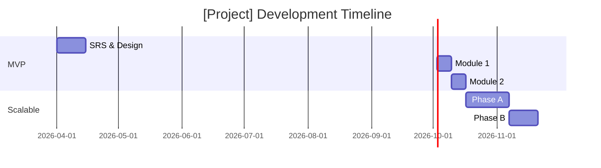

## 4.10 Risk Management

| Risk | Likelihood | Impact | Mitigation |
|---|---|---|---|
| | | | |

\newpage

# 5. Methodology

## 5.1 [Chosen Methodology]

[Brief description of Waterfall / Agile / Hybrid and why it fits this project. Include a simple flow diagram.]

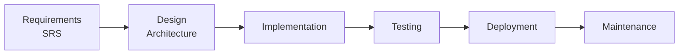

\newpage

# 6. Analysis

## 6.1 Functional Requirements

Requirements marked (MVP) are prototype scope. (Scalable) are production evolution. "Shall" = binding obligation per IEEE 830.

### 6.1.1 [Feature Area 1, e.g. Authentication]

| ID | Tier | Requirement |
|---|---|---|
| FR-1.1 | MVP | The system shall [binding requirement]. |
| FR-1.2 | MVP | The system shall [binding requirement]. |
| FR-1.N | Scalable | The system shall [binding requirement]. |

### 6.1.2 [Feature Area 2]

[Repeat the table pattern for every feature area. Typical areas: Authentication, Core Capture, Core Management, AI/Intelligence, Dispatch/Output, Preferences/Settings, Analytics/Dashboard, Collaboration.]

## 6.2 Non-Functional Requirements

### 6.2.1 Performance

| ID | Tier | Requirement | Target |
|---|---|---|---|
| NFR-P1 | MVP | | |
| NFR-P2 | MVP | | |

### 6.2.2 Security

| ID | Requirement |
|---|---|
| NFR-S1 | At-rest encryption of local data |
| NFR-S2 | Secret storage in platform keychain |
| NFR-S3 | TLS 1.2+ for all network traffic |
| NFR-S4 | No custom token handling; SDKs only |

### 6.2.3 Privacy

[Bullet list. Include data minimization, purpose limitation, GDPR Article 5 or equivalent.]

### 6.2.4 Usability

| ID | Requirement |
|---|---|
| NFR-U1 | Conforms to platform HIG |
| NFR-U2 | Dynamic Type / accessible sizing |
| NFR-U3 | Passes platform accessibility audit |
| NFR-U4 | Primary flow ≤ N taps/clicks |

### 6.2.5 Reliability

- MTBF target
- Graceful degradation strategy when external services fail

### 6.2.6 Maintainability

- Architectural pattern (MVVM, Clean Architecture, etc.)
- Unit test coverage target
- Code style enforcement (linter)

\newpage

# 7. Process and Data Modelling

## 7.1 Context Diagram (MVP)

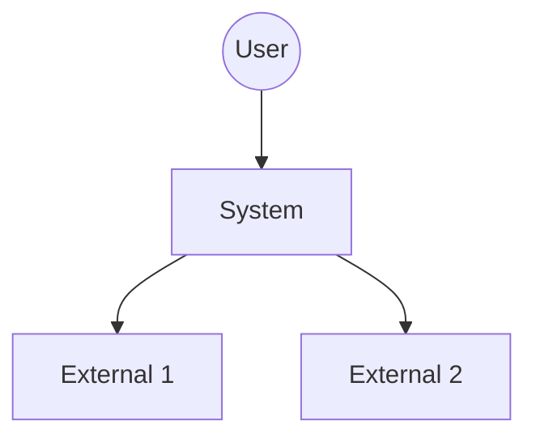

## 7.2 Context Diagram (Scalable)

[Same pattern, including any additional actors and services introduced by scalable features.]

## 7.3 DFD Level 0

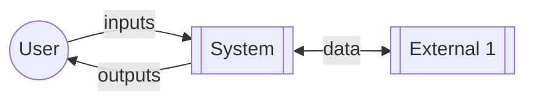

## 7.4 DFD Level 1 (MVP)

[Numbered process bubbles, data stores as cylinders, external entities as boxes. Every process from the Level 0 becomes a numbered process here.]

## 7.5 Entity-Relationship Diagram (MVP)

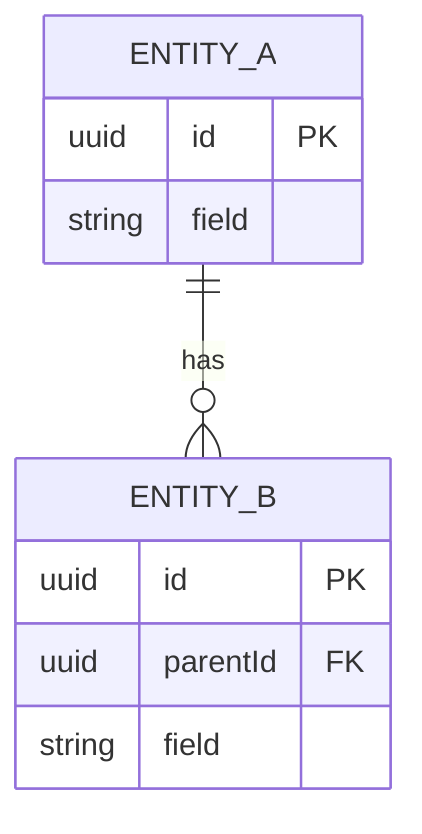

## 7.6 Entity-Relationship Diagram (Scalable Extensions)

[Additional entities introduced by scalable features — teams, pipelines, reminders, etc.]

## 7.7 Database Schema

For each entity, a table:

**EntityName**

| Field | Type | Nullable | Notes |
|---|---|---|---|
| id | UUID (PK) | No | |
| [field] | [type] | [Y/N] | |

\newpage

# 8. System Design

## 8.1 Architectural Overview (MVP)

[Paragraph: the architectural style (client-only / client-server / event-driven / etc.), the layers, the external dependencies, the properties it optimizes for. 3–5 sentences.]

## 8.2 Architectural Overview (Scalable)

[Paragraph: what's preserved, what's added, what principle the evolution respects.]

## 8.2.1 Key Design Rationales

Several design choices trade off richness for simplicity, and are documented here so reviewers can evaluate them explicitly.

**[Decision 1]:** [Trade-off and rationale in 2–4 sentences.]

**[Decision 2]:** [Trade-off and rationale in 2–4 sentences.]

**[Decision 3]:** [Trade-off and rationale in 2–4 sentences.]

[Include at least three rationales. Examples: "why X is a plain field instead of an entity," "why Y is deferred to Scalable," "why Z is capped at N," "why we chose A over B."]

## 8.3 Component Diagram (MVP)

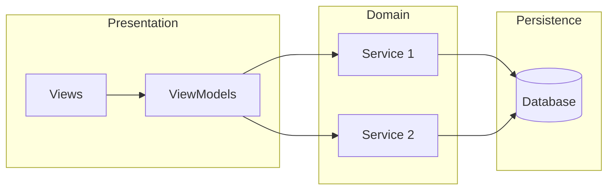

## 8.4 Component Diagram (Scalable)

[MVP diagram plus new components — sync, team, reminders, etc.]

## 8.5 Deployment Diagram (MVP)

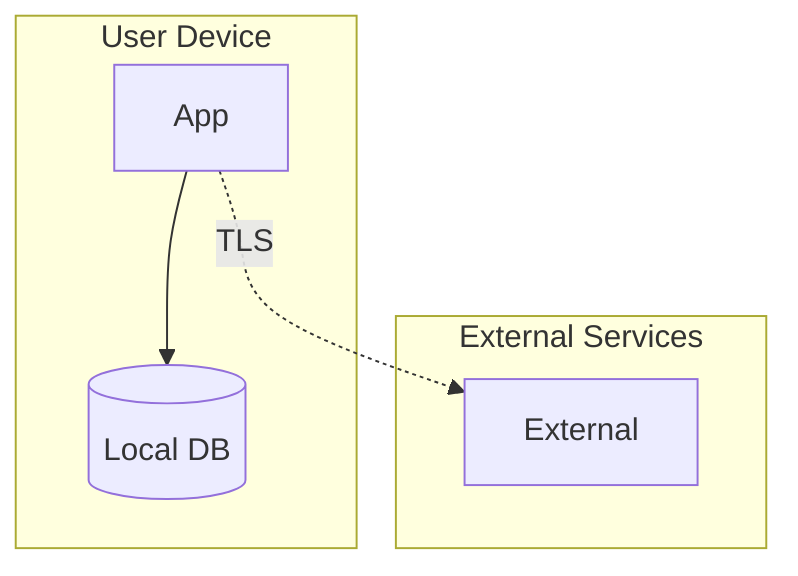

## 8.6 Deployment Diagram (Scalable)

[Includes any new infrastructure — sync backbone, serverless coordination, team backend.]

## 8.7 External Service Interfaces

For each third-party service:

### 8.7.N [Service Name]

**Endpoint:** `METHOD https://...`
**Authentication:** [OAuth scope / API key / etc.]
**Request body:** [JSON schema or example]
**Response body:** [JSON schema or example]

### URL Schemes (if applicable)

| Scheme | Use | Format |
|---|---|---|
| | | |

## 8.8 Internal Service Operations

| Service | Operation | Purpose |
|---|---|---|
| Service1 | operation(args) -> Result | |
| Service2 | operation(args) -> Result | |

## 8.9 UI Design — Key Screens (MVP)

### Screen Map

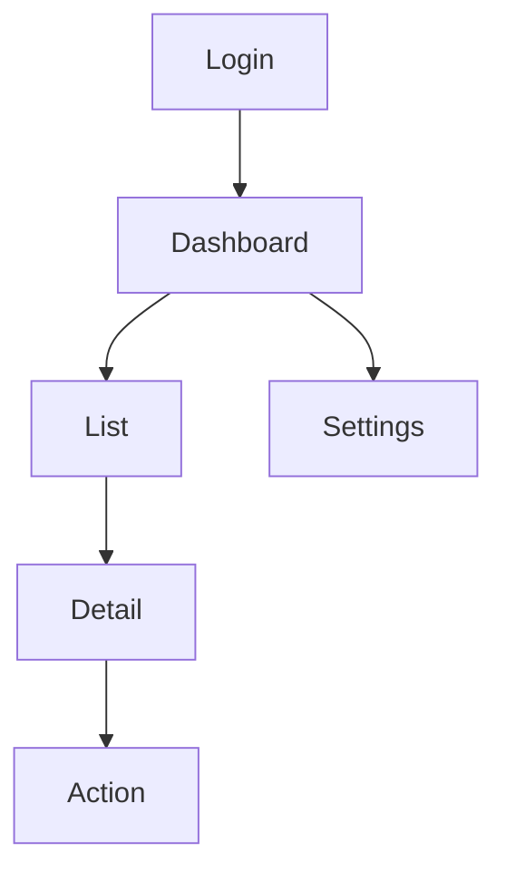

### Screen Descriptions

| Screen | Layout | Key Elements |
|---|---|---|
| | | |

\newpage

# 9. UML Diagrams

## 9.1 Use Case Diagram (MVP)

[Render as SVG, not Mermaid. See diagram-cookbook.md. Include actor(s), system boundary, use-case ellipses, associations.]

## 9.2 Use Case Diagram (Scalable)

[Additional actors and use cases introduced by scalable features.]

## 9.3 Activity Diagram — Primary Flow (MVP)

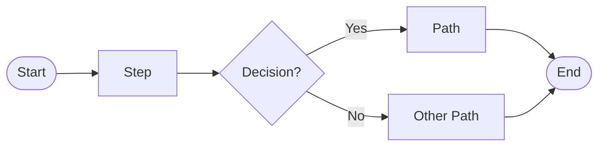

## 9.3.1 Flowchart — Detailed Decision Tree

[Every `if` statement as a diamond. Complements the activity diagram.]

```mermaid
flowchart LR
    s([Open]) --> d1{Logged In?}
    d1 -->|No| login[Login] --> dash[Dashboard]
    d1 -->|Yes| dash
    dash --> d2{Tab?}
    [continue exhaustively]
```

## 9.4 Sequence Diagram — [Primary Flow Name]

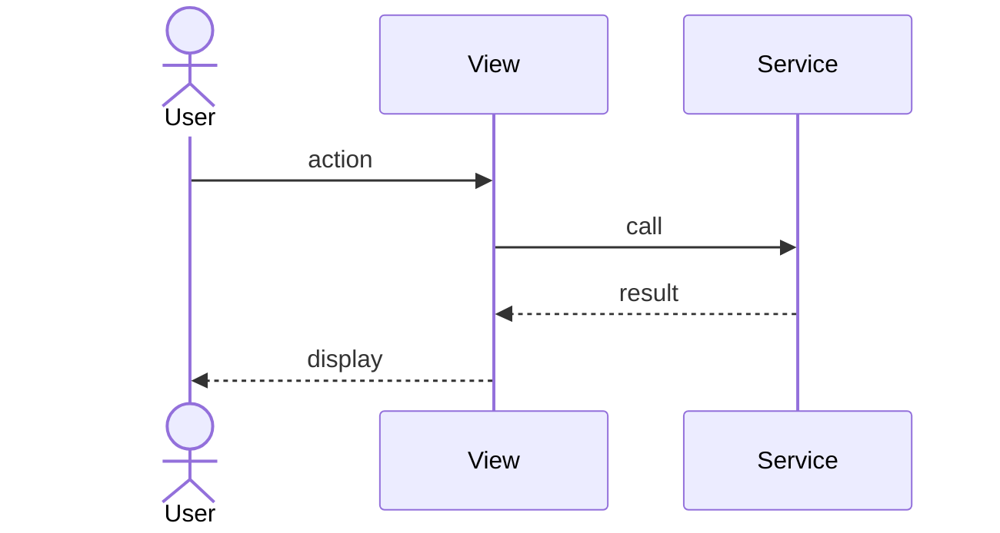

## 9.5 Sequence Diagram — [Second Flow]

[A second sequence diagram for a different important flow, e.g. AI generation, payment, sync.]

## 9.6 Sequence Diagram — [Scalable Flow]

[A sequence diagram showing a scalable-tier capability — sync, team op, etc.]

## 9.7 Class Diagram — Domain Model (MVP)

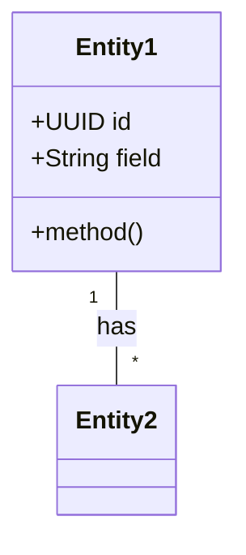

## 9.8 State Machine Diagram

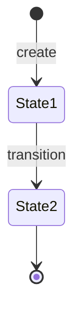

## 9.9 Package Diagram

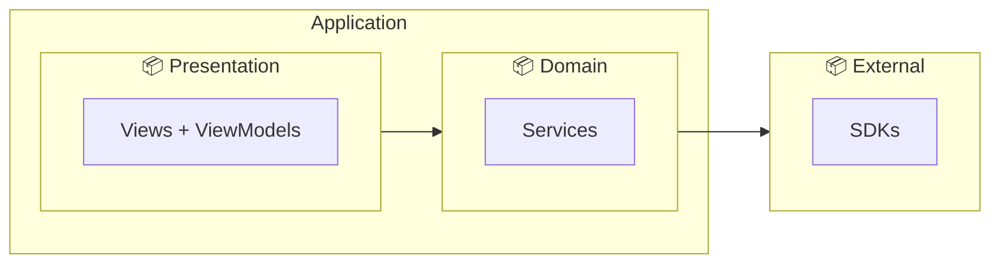

## 9.10 Object Diagram — Runtime Snapshot

[Concrete instances with real values at one moment in the system's runtime.]

## 9.11 Communication Diagram

[Numbered messages showing component collaboration for one scenario.]

## 9.12 Interaction Overview Diagram

[Composition of multiple sub-flows, showing the main app journey.]

## 9.13 Timing Diagram

[Gantt-style showing the timing of user actions, system processing, and network calls for the primary flow. Include a total-time callout.]

\newpage

# 10. MVP Design

## 10.1 MVP Definition

[One paragraph: what is the MVP? What's the core value it delivers? What's explicitly excluded?]

## 10.2 MVP vs Full System Comparison

| Capability | MVP | Scalable |
|---|---|---|
| Feature A | ✓ | ✓ |
| Feature B | — | ✓ |
| Feature C | ✓ (limited) | ✓ (full) |

## 10.3 MVP Architecture (Simplified)

[A simplified version of the component diagram showing only the MVP subset.]

## 10.4 Evolution Plan: MVP → Scalable

| Phase | Scope | Effort |
|---|---|---|
| Phase A | | |
| Phase B | | |
| Phase C | | |

\newpage

# 11. Testing

## 11.1 Testing Strategy

| Level | Scope | Tools |
|---|---|---|
| Unit | | |
| Integration | | |
| UI | | |
| Performance | | |
| Security | | |
| Compatibility | | |

## 11.2 Test Cases

| TC-ID | Feature | Test Case | Input | Expected Result | Priority |
|---|---|---|---|---|---|
| TC-01 | | | | | |
| TC-02 | | | | | |

## 11.3 Requirements Traceability Matrix

Every MVP functional requirement maps to at least one test case.

| FR ID | Requirement Summary | Test Case(s) | Priority |
|---|---|---|---|
| FR-1.1 | | TC-01 | |
| FR-1.2 | | TC-02 | |

**Non-functional coverage:**

| NFR ID | Requirement | Test Case |
|---|---|---|
| NFR-P1 | | |
| NFR-S1 | | |

\newpage

# 12. Deployment Plan

| Step | Action | Details |
|---|---|---|
| 1 | Code Freeze | |
| 2 | Final Testing | |
| 3 | Beta / TestFlight | |
| 4 | Bug Fix Sprint | |
| 5 | Submission | |
| 6 | Review | |
| 7 | Release | |
| 8 | Post-Launch Monitoring | |

**Privacy / Store Metadata Requirements:** [platform-specific labels, disclosures]

\newpage

# 13. Maintenance Plan

| Area | Plan |
|---|---|
| Bug Fixes | |
| Platform Updates | |
| Dependency Updates | |
| Third-Party API Versioning | |
| Security Patches | |
| Feature Updates | |
| Data Migration | |
| User Support | |
| Analytics | |

\newpage

# 14. Documentation and References

1. IEEE, *IEEE Std 830-1998: Recommended Practice for Software Requirements Specifications*, 1998.
2. [Every framework, SDK, RFC, standard, or academic reference actually cited in the document body.]
3. [Keep ordered, numbered, and formatted consistently.]

---

*End of Complete SRS — [Project Name] v1.0*
